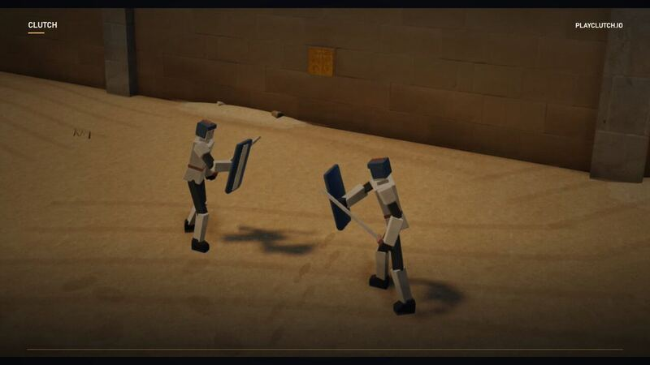

[← Back to gallery](../browse/interactive.en.md) · [简体中文](2103888380794712109.md)

# Different models for game development and video

**[1love · @loverWNL](https://x.com/loverWNL)** · 3D & interactive · 36s

**[▶ Open gallery to play](https://guanmo-ai.github.io/awesome-ai-motion/?lang=en#case-2103888380794712109)** · [Original post](https://x.com/loverWNL/status/2103888380794712109)

Click the cover to open the gallery and play.

The creator attributes game development to Opus 5.5 but says the video work moved to Astra after their allowance ran out, separating the roles of the two models.

Author brief · not the complete prompt. The complete instructions have not been verified; see the creator’s post. [View the original post](https://x.com/loverWNL/status/2103888380794712109)

Bookmarks 0 · Likes 0 · Views 74

## Source record

- Original post: [@loverWNL](https://x.com/loverWNL/status/2103888380794712109) · 2026-09-26T16:44:12+00:00
- Model attribution: Opus 5.5 / Astra · [Creator’s statement](https://x.com/loverWNL/status/2103888380794712109)
- Prompt source: [Creator post](https://x.com/loverWNL/status/2103888380794712109) · 2026-10-10 04:55 UTC
- Cover source: [Original cover source](https://pbs.twimg.com/amplify_video_thumb/2103887846104870912/img/RdtbicxB1jljnelr.jpg)
- Metrics snapshot: [Original X post](https://x.com/loverWNL/status/2103888380794712109) · 2026-10-10 04:55 UTC
- Gallery video source: [Original post media record](https://x.com/loverWNL/status/2103888380794712109) · 2026-10-10 04:56 UTC · Post/media correspondence and media response checked; external reference, no re-upload

Model attribution is based on creator statements. Prompts have not been independently rerun; sound and visuals have not received a uniform quality rating. Videos reference original post media, not our uploads; redistribution permission has not been verified.
