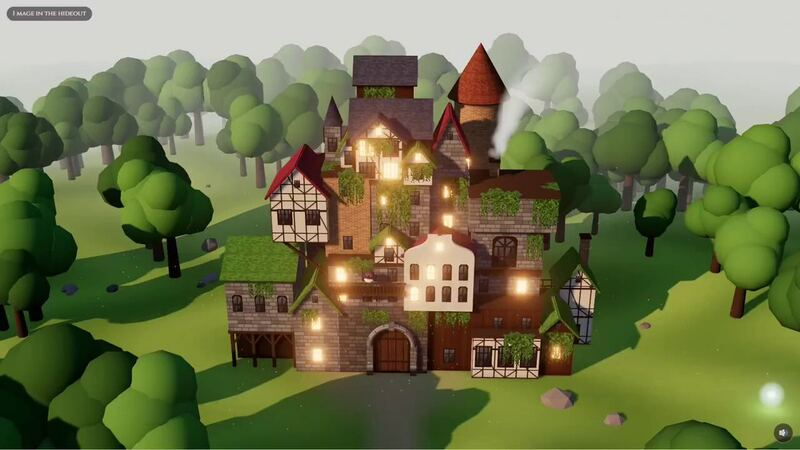

[← 返回图库](../browse/interactive.md) · [English](2103938636173742305.en.md)

# 黑色暴牛据点：访客成为漂浮光点

**[Lluís Ribés · @lribes4](https://x.com/lribes4)** · 交互演示 · 23s

**[▶ 打开画廊播放](https://guanmo-ai.github.io/awesome-ai-motion/#case-2103938636173742305)** · [作者原帖](https://x.com/lribes4/status/2103938636173742305)

点击封面打开画廊播放。

[黑色暴牛据点体验页](https://ribes.cc/hideout/)

作者用 Opus 5.5 与 Three.js 制作《黑色五叶草》主题三维据点，每位访客以漂浮光点出现，并提供可拖动视角的网页入口。

## 源码与网页

- **公开网页**：[黑色暴牛据点体验页](https://ribes.cc/hideout/)
  作者直接链接的三维网页，说明访客光点与拖动视角；页面入口不代表提供完整工程或复用许可。
  [链接出处](https://x.com/lribes4/status/2103938636173742305) · 链接核对 2026-10-10 04:57 UTC

作者任务描述 · 非完整提示词。完整指令尚未取得，请查看作者原帖。 [查看作者原帖](https://x.com/lribes4/status/2103938636173742305)

收藏 0 · 点赞 2 · 浏览 424

## 来源记录

- 作品原帖: [@lribes4](https://x.com/lribes4/status/2103938636173742305) · 2026-09-26T20:03:54+00:00
- 模型归因: Opus 5.5 · [作者说明](https://x.com/lribes4/status/2103938636173742305)
- 提示词出处: [作者原帖](https://x.com/lribes4/status/2103938636173742305) · 2026-10-10 04:55 UTC
- 封面来源: [原帖封面来源](https://pbs.twimg.com/amplify_video_thumb/2103938601021018112/img/Ie2zmoAmseNxqgWd.jpg)
- 互动快照: [X 原帖](https://x.com/lribes4/status/2103938636173742305) · 2026-10-10 04:55 UTC
- 画廊原视频: [原帖媒体记录](https://x.com/lribes4/status/2103938636173742305) · 2026-10-10 04:57 UTC · 已核对原帖媒体对应与媒体响应；外部引用，不重新上传

模型依据来自作者自述，未独立重跑提示词，也未对音画作统一质量评级。视频引用作者原帖媒体，未由本站重新上传，转载许可未确认。
