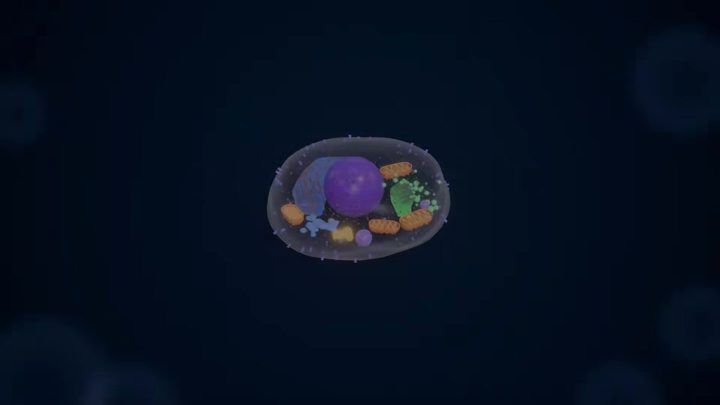

[← 返回图库](../browse/education.md) · [English](2104105016235860050.en.md)

<a id="case-2104105016235860050"></a>

# 3D 细胞教学视频

**[WY · @akokoi1](https://x.com/akokoi1)** · 知识讲解 · 230s

> 发现池 · 已核对作者原帖与媒体来源，尚未完整审看。

**[▶ 打开画廊播放](https://guanmo-ai.github.io/awesome-ai-motion/#case-2104105016235860050)** · [作者原帖](https://x.com/akokoi1/status/2104105016235860050)

点击封面打开画廊播放。

[](https://guanmo-ai.github.io/awesome-ai-motion/#case-2104105016235860050)


WY 发布的3D 细胞教学视频。制作方式依据作者原帖说明；来源已核对，完整音画待审看。

**作者任务描述 · 非完整提示词** · [出处](https://x.com/akokoi1/status/2104105016235860050) · [纯文本](../prompts/2104105016235860050.txt)

```text
让Opus 5.5根据3D资产做一个适合中学生的教学视频。
```

<sub>收藏 72 · 点赞 62 · 浏览 4,624</sub>


## 来源记录

- 作品原帖: [@akokoi1](https://x.com/akokoi1/status/2104105016235860050) · 2026-09-27T07:05:02+00:00
- 模型归因: Claude Opus 5.5 · [作者说明](https://x.com/akokoi1/status/2104105016235860050)
- 提示词出处: [作者原帖](https://x.com/akokoi1/status/2104105016235860050) · 2026-09-27 17:13 UTC
- 封面来源: [原帖封面来源](https://pbs.twimg.com/amplify_video_thumb/2104104389426487297/img/CAQ4cqA-ZYfth8l5.jpg)
- 互动数据: [X](https://x.com/akokoi1/status/2104105016235860050) · 2026-09-27 17:13 UTC · 第三方匿名读取，非 X 官方 API
- 发现入口: Grok public X search
- 画廊原视频: [原帖媒体记录](https://x.com/akokoi1/status/2104105016235860050) · 2026-09-27 17:14 UTC · 已核对原帖媒体对应与媒体响应；外部引用，不重新上传

模型依据来自作者自述，未独立重跑提示词，也未对音画作统一质量评级。视频引用作者原帖媒体，未由本站重新上传，转载许可未确认。
