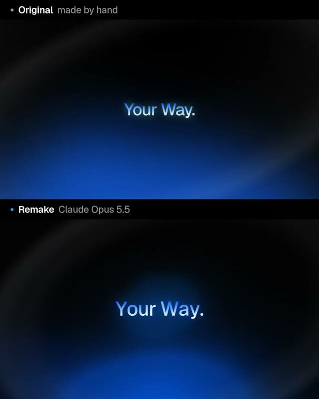

[← Back to gallery](../browse/product.en.md) · [简体中文](2104131805175844923.md)

# Stream Launch Film: Original and Code Recreation

**[Jurgen Ploeger · @JurgenPloeger](https://x.com/JurgenPloeger)** · Product & marketing · 48s

> Discovery pool · Source verified; catalog details being completed.

**[▶ Open gallery to play](https://guanmo-ai.github.io/awesome-ai-motion/?lang=en#case-2104131805175844923)** · [Original post](https://x.com/JurgenPloeger/status/2104131805175844923)

Click the cover to open the gallery and play.

The creator gave Opus 5.5 a Stream launch film they made by hand six months earlier and its Figma file to rebuild the scenes in code to music. The original is above and the model version below.

No public prompt has been verified. [View the original post](https://x.com/JurgenPloeger/status/2104131805175844923)

Bookmarks 97 · Likes 120 · Views 16,733

## Source record

- Original post: [@JurgenPloeger](https://x.com/JurgenPloeger/status/2104131805175844923) · 2026-09-27T08:51:29Z
- Model attribution: Claude Opus 5.5 · [Creator’s statement](https://x.com/JurgenPloeger/status/2104131805175844923)
- Prompt lookup: [Creator post](https://x.com/JurgenPloeger/status/2104131805175844923) · 2026-09-29 03:37 UTC
- Cover source: [Original cover source](https://x.com/JurgenPloeger/status/2104131805175844923) · 8s
- Metrics snapshot: [Original X post](https://x.com/JurgenPloeger/status/2104131805175844923) · 2026-09-29 03:37 UTC
- Gallery video source: [Original post media record](https://x.com/JurgenPloeger/status/2104131805175844923) · 2026-09-29 03:39 UTC · Post/media correspondence and media response checked; external reference, no re-upload

Model attribution is based on creator statements. Prompts have not been independently rerun; sound and visuals have not received a uniform quality rating. Videos reference original post media, not our uploads; redistribution permission has not been verified.
