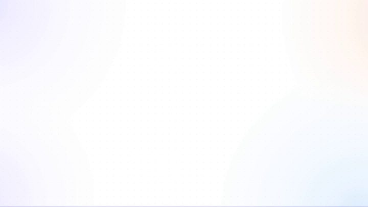

[← Back to gallery](../browse/education.en.md) · [简体中文](2104151743907160546.md)

# How to Do Great Work video

**[Deedy · @deedydas](https://x.com/deedydas)** · Education & explainers · 195s

> Discovery pool · Creator post and media source verified; full viewing review pending.

**[▶ Watch video](https://video.twimg.com/amplify_video/2104151706158374912/vid/avc1/1920x1080/GJrwHTE-SScZZIFI.mp4?tag=29)**

[Original post](https://x.com/deedydas/status/2104151743907160546)

How to Do Great Work video, shared by Deedy. Production attribution follows the creator’s post. Source verified; full viewing review pending.

No public prompt has been verified. [View the original post](https://x.com/deedydas/status/2104151743907160546)

Bookmarks 2,879 · Likes 2,417 · Views 103,756

## Source record

- Original post: [@deedydas](https://x.com/deedydas/status/2104151743907160546) · 2026-09-27T10:10:43+00:00
- Model attribution: Claude Opus (version unspecified) · [Creator’s statement](https://x.com/deedydas/status/2104151743907160546)
- Prompt lookup: [Creator post](https://x.com/deedydas/status/2104151743907160546) · 2026-09-27 17:13 UTC
- Cover source: [Original media](https://pbs.twimg.com/amplify_video_thumb/2104151706158374912/img/l7LMZQfV-KRH0hXG.jpg)
- Metrics: [X](https://x.com/deedydas/status/2104151743907160546) · 2026-09-27 17:13 UTC · Anonymous third-party snapshot, not the official X API
- Discovered via: Grok public X search
- Gallery video source: [Original post media](https://video.twimg.com/amplify_video/2104151706158374912/vid/avc1/1920x1080/GJrwHTE-SScZZIFI.mp4?tag=29) · 2026-09-27 17:14 UTC · Post/media correspondence and media response checked; external reference, no re-upload

Model attribution is based on creator statements. Prompts have not been independently rerun; sound and visuals have not received a uniform quality rating. Videos reference original post media, not our uploads; redistribution permission has not been verified.
