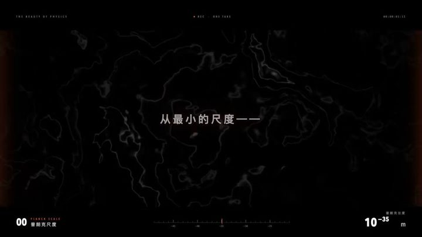

[← Back to gallery](../browse/motion.en.md) · [简体中文](2104200939095904322.md)

<a id="case-2104200939095904322"></a>

# One shot beauty of physics animation

**[WY · @akokoi1](https://x.com/akokoi1)** · Motion design · 76s

> Discovery pool · Creator post and media source verified; full viewing review pending.

**[▶ Open gallery to play](https://guanmo-ai.github.io/awesome-ai-motion/?lang=en#case-2104200939095904322)** · [Original post](https://x.com/akokoi1/status/2104200939095904322)

Click the cover to open the gallery and play.

[](https://guanmo-ai.github.io/awesome-ai-motion/?lang=en#case-2104200939095904322)


One shot beauty of physics animation, shared by WY. Production attribution follows the creator’s post. Source verified; full viewing review pending.

**Creator’s public prompt** · [Source](https://x.com/akokoi1/status/2104200939095904322) · [Plain text](../prompts/2104200939095904322.txt)

```text
生成一个视频，展示物理之美，要有电影感，高级感，一镜到底
```

<sub>Bookmarks 14 · Likes 27 · Views 1,980</sub>


## Source record

- Original post: [@akokoi1](https://x.com/akokoi1/status/2104200939095904322) · 2026-09-27T13:26:12+00:00
- Model attribution: Claude Opus 5.5 · [Creator’s statement](https://x.com/akokoi1/status/2104200939095904322)
- Prompt source: [Creator post](https://x.com/akokoi1/status/2104200939095904322) · 2026-09-27 17:13 UTC
- Cover source: [Original cover source](https://pbs.twimg.com/amplify_video_thumb/2104200724808929280/img/1EElMM5mw3f1mOmo.jpg)
- Metrics: [X](https://x.com/akokoi1/status/2104200939095904322) · 2026-09-27 17:13 UTC · Anonymous third-party snapshot, not the official X API
- Discovered via: Grok public X search
- Gallery video source: [Original post media record](https://x.com/akokoi1/status/2104200939095904322) · 2026-09-27 17:14 UTC · Post/media correspondence and media response checked; external reference, no re-upload

Model attribution is based on creator statements. Prompts have not been independently rerun; sound and visuals have not received a uniform quality rating. Videos reference original post media, not our uploads; redistribution permission has not been verified.
