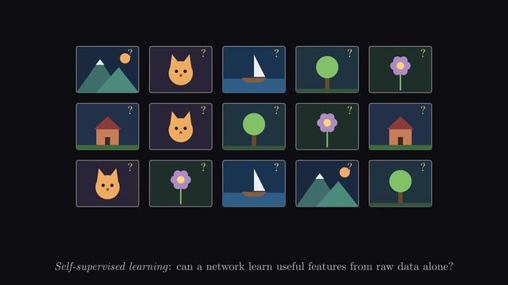

[← Back to gallery](../browse/education.en.md) · [简体中文](2104211152662106358.md)

<a id="case-2104211152662106358"></a>

# LeJEPA paper animated explainer

**[Simon · @SimonGoodman\_](https://x.com/SimonGoodman_)** · Education & explainers · 384s

> Discovery pool · Creator post and media source verified; full viewing review pending.

**[▶ Watch on X](https://x.com/SimonGoodman_/status/2104211152662106358)**

[](https://x.com/SimonGoodman_/status/2104211152662106358)


LeJEPA paper animated explainer, shared by Simon. Production attribution follows the creator’s post. Source verified; full viewing review pending.

**Author brief · not the complete prompt** · [Source](https://x.com/SimonGoodman_/status/2104211152662106358) · [Plain text](../prompts/2104211152662106358.txt)

```text
I gave it a paper (LeJepa by R. Balestriero and Y. Lecun) and asked for a manim video explaining the paper.
```

<sub>Bookmarks 0 · Likes 0 · Views 30</sub>


## Source record

- Original post: [@SimonGoodman\_](https://x.com/SimonGoodman_/status/2104211152662106358) · 2026-09-27T14:06:47+00:00
- Model attribution: Claude Opus 5.5 · [Creator’s statement](https://x.com/SimonGoodman_/status/2104211152662106358)
- Prompt source: [Creator post](https://x.com/SimonGoodman_/status/2104211152662106358) · 2026-09-27 17:13 UTC
- Cover source: [Original cover source](https://pbs.twimg.com/amplify_video_thumb/2104209804948357120/img/Ay4BfexbetbG5MbR.jpg)
- Metrics: [X](https://x.com/SimonGoodman_/status/2104211152662106358) · 2026-09-27 17:13 UTC · Anonymous third-party snapshot, not the official X API
- Discovered via: Grok public X search
- Gallery video source: [Original post media record](https://x.com/SimonGoodman_/status/2104211152662106358) · 2026-09-27 17:14 UTC · Post/media correspondence and media response checked; external reference, no re-upload

Model attribution is based on creator statements. Prompts have not been independently rerun; sound and visuals have not received a uniform quality rating. Videos reference original post media, not our uploads; redistribution permission has not been verified.
