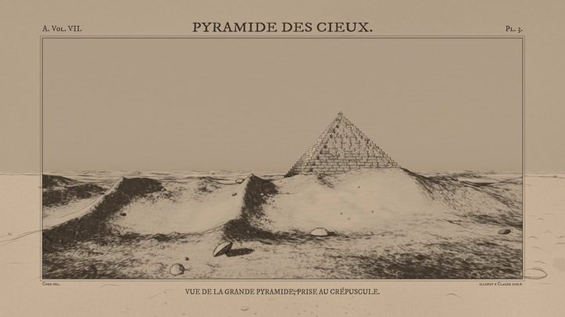

[← 返回图库](../browse/motion.md) · [English](2104214763358015565.en.md)

# 石块绘制的幻想版画动画

**[illodev · @illodevcode](https://x.com/illodevcode)** · 短动效 · 64s

> 发现池 · 已核对作者原帖与媒体来源，尚未完整审看。

**[▶ 打开画廊播放](https://guanmo-ai.github.io/awesome-ai-motion/#case-2104214763358015565)** · [作者原帖](https://x.com/illodevcode/status/2104214763358015565)

点击封面打开画廊播放。

illodev 发布的石块绘制的幻想版画动画。制作方式依据作者原帖说明；来源已核对，完整音画待审看。

未取得作者公开提示词。 [查看作者原帖](https://x.com/illodevcode/status/2104214763358015565)

收藏 0 · 点赞 9 · 浏览 15,928

## 来源记录

- 作品原帖: [@illodevcode](https://x.com/illodevcode/status/2104214763358015565) · 2026-09-27T14:21:08+00:00
- 模型归因: Claude Opus 5.5 · [作者说明](https://x.com/illodevcode/status/2104214763358015565)
- 提示词查阅记录: [作者原帖](https://x.com/illodevcode/status/2104214763358015565) · 2026-09-27 17:13 UTC
- 封面来源: [原帖封面来源](https://pbs.twimg.com/amplify_video_thumb/2104213316306399232/img/jr5i1d01q9bAY8wx.jpg)
- 互动快照: [X 原帖](https://x.com/illodevcode/status/2104214763358015565) · 2026-09-27 17:13 UTC
- 画廊原视频: [原帖媒体记录](https://x.com/illodevcode/status/2104214763358015565) · 2026-09-27 17:14 UTC · 已核对原帖媒体对应与媒体响应；外部引用，不重新上传

模型依据来自作者自述，未独立重跑提示词，也未对音画作统一质量评级。视频引用作者原帖媒体，未由本站重新上传，转载许可未确认。
