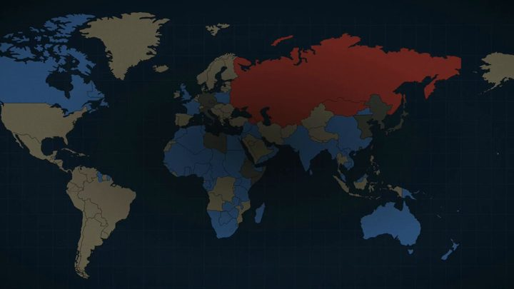

[← 返回图库](../browse/education.md) · [English](2104247692503204330.en.md)

# 两分钟二战讲解片

**[Miguel Ángel · @Miguel07Code](https://x.com/Miguel07Code)** · 知识讲解 · 115s

> 发现池 · 已核对作者原帖与媒体来源，尚未完整审看。

**[▶ 打开画廊播放](https://guanmo-ai.github.io/awesome-ai-motion/#case-2104247692503204330)** · [作者原帖](https://x.com/Miguel07Code/status/2104247692503204330)

点击封面打开画廊播放。

Miguel Ángel 发布的两分钟二战讲解片。制作方式依据作者原帖说明；来源已核对，完整音画待审看。

未取得作者公开提示词。 [查看作者原帖](https://x.com/Miguel07Code/status/2104247692503204330)

收藏 4 · 点赞 13 · 浏览 468

## 来源记录

- 作品原帖: [@Miguel07Code](https://x.com/Miguel07Code/status/2104247692503204330) · 2026-09-27T16:31:59+00:00
- 模型归因: Claude Opus 5.5 · [作者说明](https://x.com/Miguel07Code/status/2104247692503204330)
- 提示词查阅记录: [作者原帖](https://x.com/Miguel07Code/status/2104247692503204330) · 2026-09-27 17:13 UTC
- 封面来源: [原帖封面来源](https://pbs.twimg.com/amplify_video_thumb/2104246981136707584/img/a5-7xbwWtoypRJRI.jpg)
- 互动快照: [X 原帖](https://x.com/Miguel07Code/status/2104247692503204330) · 2026-09-27 17:13 UTC
- 画廊原视频: [原帖媒体记录](https://x.com/Miguel07Code/status/2104247692503204330) · 2026-09-27 17:14 UTC · 已核对原帖媒体对应与媒体响应；外部引用，不重新上传

模型依据来自作者自述，未独立重跑提示词，也未对音画作统一质量评级。视频引用作者原帖媒体，未由本站重新上传，转载许可未确认。
