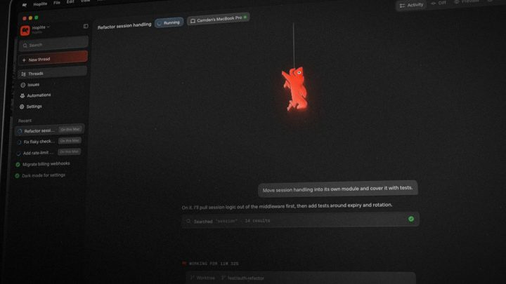

[← 返回图库](../browse/product.md) · [English](2104249941136666741.en.md)

<a id="case-2104249941136666741"></a>

# Hoplite 功能发布动效

**[Ryan Morrissey · @ryan\_morr](https://x.com/ryan_morr)** · 产品宣传 · 32s

> 发现池 · 已核对作者原帖与媒体来源，尚未完整审看。

**[▶ 在 X 原帖观看](https://x.com/ryan_morr/status/2104249941136666741)**

[](https://x.com/ryan_morr/status/2104249941136666741)


Ryan Morrissey 发布的Hoplite 功能发布动效。制作方式依据作者原帖说明；来源已核对，完整音画待审看。

**作者公开提示词** · [出处](https://x.com/ryan_morr/status/2104249941136666741) · [纯文本](../prompts/2104249941136666741.txt)

```text
using the existing brand elements of hoplite create a feature launch video for closing your laptop with the hoplite mac app and seamlessly moving your agents to the cloud.
```

<sub>收藏 2 · 点赞 9 · 浏览 174</sub>


## 来源记录

- 作品原帖: [@ryan\_morr](https://x.com/ryan_morr/status/2104249941136666741) · 2026-09-27T16:40:55+00:00
- 模型归因: Claude Opus 5.5 · [作者说明](https://x.com/ryan_morr/status/2104249941136666741)
- 提示词出处: [作者原帖](https://x.com/ryan_morr/status/2104249941136666741) · 2026-09-27 17:13 UTC
- 封面来源: [原帖封面来源](https://pbs.twimg.com/amplify_video_thumb/2104249853341474817/img/gxaW2u0uQaVa9GqW.jpg)
- 互动数据: [X](https://x.com/ryan_morr/status/2104249941136666741) · 2026-09-27 17:13 UTC · 第三方匿名读取，非 X 官方 API
- 发现入口: Grok public X search
- 画廊原视频: [原帖媒体记录](https://x.com/ryan_morr/status/2104249941136666741) · 2026-09-27 17:14 UTC · 已核对原帖媒体对应与媒体响应；外部引用，不重新上传

模型依据来自作者自述，未独立重跑提示词，也未对音画作统一质量评级。视频引用作者原帖媒体，未由本站重新上传，转载许可未确认。
