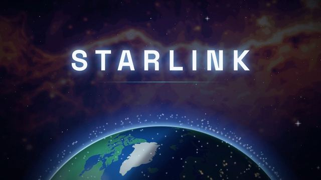

[← Back to gallery](../browse/education.en.md) · [简体中文](2104256238246596651.md)

# How Starlink works explainer

**[omni · @omni1896837](https://x.com/omni1896837)** · Education & explainers · 274s

> Discovery pool · Creator post and media source verified; full viewing review pending.

**[▶ Watch on X](https://x.com/omni1896837/status/2104256238246596651)**

How Starlink works explainer, shared by omni. Production attribution follows the creator’s post. Source verified; full viewing review pending.

No public prompt has been verified. [View the original post](https://x.com/omni1896837/status/2104256238246596651)

Bookmarks 0 · Likes 1 · Views 9

## Source record

- Original post: [@omni1896837](https://x.com/omni1896837/status/2104256238246596651) · 2026-09-27T17:05:57+00:00
- Model attribution: Claude Opus 5.5 · [Creator’s statement](https://x.com/omni1896837/status/2104256238246596651)
- Prompt lookup: [Creator post](https://x.com/omni1896837/status/2104256238246596651) · 2026-09-27 17:13 UTC
- Cover source: [Original cover source](https://pbs.twimg.com/amplify_video_thumb/2104254856449949696/img/iQBAnqIxe4SGl0rL.jpg)
- Metrics: [X](https://x.com/omni1896837/status/2104256238246596651) · 2026-09-27 17:13 UTC · Anonymous third-party snapshot, not the official X API
- Discovered via: Grok public X search
- Gallery video source: [Original post media record](https://x.com/omni1896837/status/2104256238246596651) · 2026-09-27 17:14 UTC · Post/media correspondence and media response checked; external reference, no re-upload

Model attribution is based on creator statements. Prompts have not been independently rerun; sound and visuals have not received a uniform quality rating. Videos reference original post media, not our uploads; redistribution permission has not been verified.
