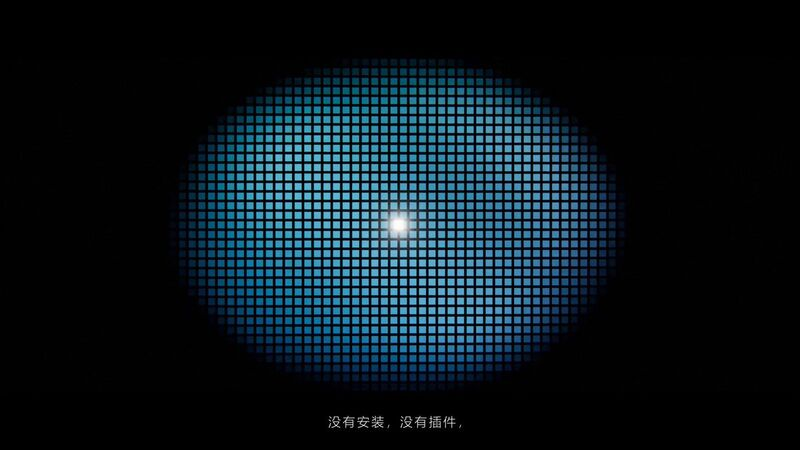

[← 返回图库](../browse/motion.md) · [English](2104788406656184436.en.md)

# Three.js 之美：电影感长镜头

**[yupengfei · @yupengfei990919](https://x.com/yupengfei990919)** · 短动效 · 113s

> 发现池 · 来源已核对，编目资料待完善。

**[▶ 打开画廊播放](https://guanmo-ai.github.io/awesome-ai-motion/#case-2104788406656184436)** · [作者原帖](https://x.com/yupengfei990919/status/2104788406656184436)

点击封面打开画廊播放。

作者要求 Opus 5.5 用约两分钟长镜头展示 Three.js 的建模、材质、光影、相机、粒子和着色器能力，并在原帖给出中文指令；附件实际约113秒。

作者已公开指令；本站仅提供原帖入口，不再分发全文或译文。 [查看作者原文](https://x.com/yupengfei990919/status/2104788406656184436)

收藏 0 · 点赞 0 · 浏览 5

## 来源记录

- 作品原帖: [@yupengfei990919](https://x.com/yupengfei990919/status/2104788406656184436) · 2026-09-29T04:20:35Z
- 模型归因: Claude Opus 5.5 · [作者说明](https://x.com/yupengfei990919/status/2104788406656184436)
- 提示词出处: [作者原帖](https://x.com/yupengfei990919/status/2104788406656184436) · 2026-09-29 04:51 UTC
- 封面来源: [原帖封面来源](https://pbs.twimg.com/amplify_video_thumb/2104787682966835200/img/y4lVIGJ0KJoSwuy3.jpg)
- 互动快照: [X 原帖](https://x.com/yupengfei990919/status/2104788406656184436) · 2026-09-29 04:51 UTC
- 画廊原视频: [原帖媒体记录](https://x.com/yupengfei990919/status/2104788406656184436) · 2026-09-29 04:53 UTC · 已核对原帖媒体对应与媒体响应；外部引用，不重新上传

模型依据来自作者自述，未独立重跑提示词，也未对音画作统一质量评级。视频引用作者原帖媒体，未由本站重新上传，转载许可未确认。
