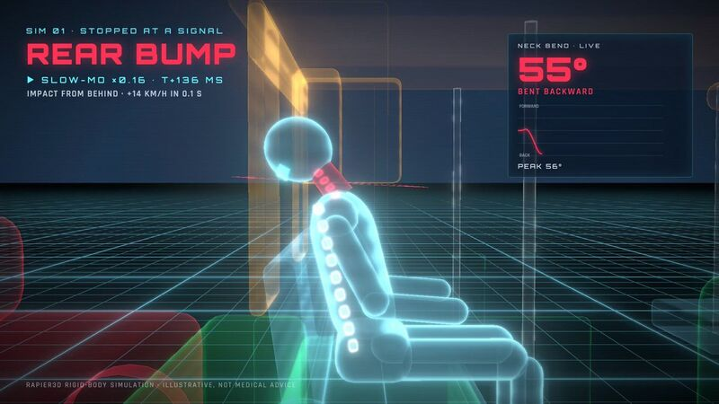

[← Back to gallery](../browse/education.en.md) · [简体中文](2105360011916697713.md)

# An auto-rickshaw braking and collision illustration

**[Shobhit - Building SuperCmd · @nullbytes00](https://x.com/nullbytes00)** · Education & explainers · 30s

> Discovery pool · Source verified; catalog details being completed.

**[▶ Open gallery to play](https://guanmo-ai.github.io/awesome-ai-motion/?lang=en#case-2105360011916697713)** · [Original post](https://x.com/nullbytes00/status/2105360011916697713)

Click the cover to open the gallery and play.

The creator uses Opus 5.5 and the brag skill for a 30-second illustration of sudden braking and a collision in an auto-rickshaw, reporting about $4.29 in model usage. This is a creator demo; its medical and mechanical claims have not been independently checked.

No public prompt has been verified. [View the original post](https://x.com/nullbytes00/status/2105360011916697713)

Bookmarks 0 · Likes 1 · Views 65

## Source record

- Original post: [@nullbytes00](https://x.com/nullbytes00/status/2105360011916697713) · 2026-09-30T18:11:57+00:00
- Model attribution: Claude Opus 5.5 · [Creator’s statement](https://x.com/nullbytes00/status/2105360011916697713)
- Prompt lookup: [Creator post](https://x.com/nullbytes00/status/2105360011916697713) · 2026-09-30 18:22 UTC
- Cover source: [Original cover source](https://pbs.twimg.com/amplify_video_thumb/2105355768669376512/img/X6WS8ON8mvtZX3bM.jpg)
- Metrics snapshot: [Original X post](https://x.com/nullbytes00/status/2105360011916697713) · 2026-09-30 18:22 UTC
- Gallery video source: [Original post media record](https://x.com/nullbytes00/status/2105360011916697713) · 2026-09-30 18:24 UTC · Post/media correspondence and media response checked; external reference, no re-upload

Model attribution is based on creator statements. Prompts have not been independently rerun; sound and visuals have not received a uniform quality rating. Videos reference original post media, not our uploads; redistribution permission has not been verified.
