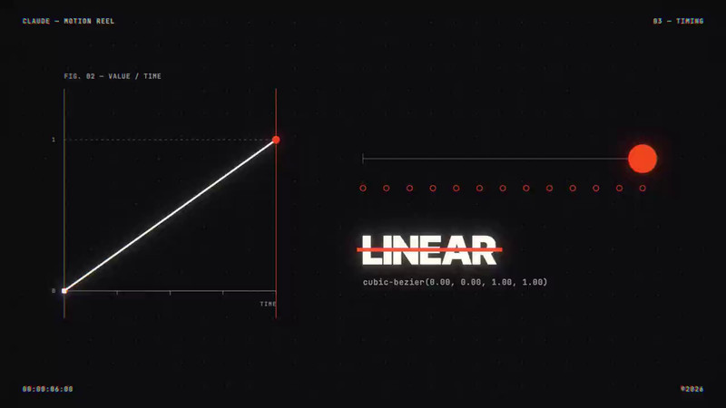

[← 返回图库](../browse/motion.md) · [English](2105758042830549235.en.md)

# 15 秒动效：两次同题试验

**[mesmer · @mesmerlord](https://x.com/mesmerlord)** · 短动效 · 15s

> 发现池 · 来源已核对，编目资料待完善。

**[▶ 打开画廊播放](https://guanmo-ai.github.io/awesome-ai-motion/#case-2105758042830549235)** · [作者原帖](https://x.com/mesmerlord/status/2105758042830549235)

点击封面打开画廊播放。

作者展示同题的两支 15 秒动效，画面包含曲线、线性运动与文字排版，并讨论视觉焦点与节拍同步。画廊播放第一支，两支均可从原帖观看；作者称使用 Fable 5.5，版本未独立核实。

未取得作者公开提示词。 [查看作者原帖](https://x.com/mesmerlord/status/2105758042830549235)

收藏 65 · 点赞 178 · 浏览 17,991

## 来源记录

- 作品原帖: [@mesmerlord](https://x.com/mesmerlord/status/2105758042830549235) · 2026-10-01T20:33:35+00:00
- 模型归因: Claude (reported Fable 5.5; version unverified) · [作者说明](https://x.com/mesmerlord/status/2105758042830549235)
- 提示词查阅记录: [作者原帖](https://x.com/mesmerlord/status/2105758042830549235) · 2026-10-02 09:20 UTC
- 封面来源: [原帖封面来源](https://x.com/mesmerlord/status/2105758042830549235) · 6s
- 互动快照: [X 原帖](https://x.com/mesmerlord/status/2105758042830549235) · 2026-10-02 09:20 UTC
- 画廊原视频: [原帖媒体记录](https://x.com/mesmerlord/status/2105758042830549235) · 2026-10-02 09:20 UTC · 已核对原帖媒体对应与媒体响应；外部引用，不重新上传

模型依据来自作者自述，未独立重跑提示词，也未对音画作统一质量评级。视频引用作者原帖媒体，未由本站重新上传，转载许可未确认。

原帖包含 2 个视频，本封面对应第一条。
