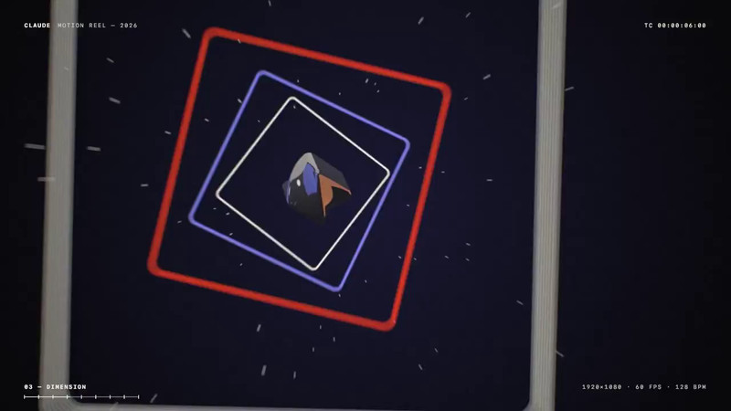

[← 返回图库](../browse/motion.md) · [English](2105766824558174486.en.md)

# 15 秒 Opus 几何动效对照

**[mesmer · @mesmerlord](https://x.com/mesmerlord)** · 短动效 · 15s

> 发现池 · 来源已核对，编目资料待完善。

**[▶ 打开画廊播放](https://guanmo-ai.github.io/awesome-ai-motion/#case-2105766824558174486)** · [作者原帖](https://x.com/mesmerlord/status/2105766824558174486)

点击封面打开画廊播放。

作者补发 Opus 5.5 的 15 秒几何动效作为对照，旋转方框、文字与几何元素组成短片。速度感和声音优劣是作者的评价，本站未完成整片视听评价。

未取得作者公开提示词。 [查看作者原帖](https://x.com/mesmerlord/status/2105766824558174486)

收藏 2 · 点赞 4 · 浏览 904

## 来源记录

- 作品原帖: [@mesmerlord](https://x.com/mesmerlord/status/2105766824558174486) · 2026-10-01T21:08:28+00:00
- 模型归因: Claude Opus 5.5 · [作者说明](https://x.com/mesmerlord/status/2105766824558174486)
- 提示词查阅记录: [作者原帖](https://x.com/mesmerlord/status/2105766824558174486) · 2026-10-02 09:20 UTC
- 封面来源: [原帖封面来源](https://x.com/mesmerlord/status/2105766824558174486) · 6s
- 互动快照: [X 原帖](https://x.com/mesmerlord/status/2105766824558174486) · 2026-10-02 09:20 UTC
- 画廊原视频: [原帖媒体记录](https://x.com/mesmerlord/status/2105766824558174486) · 2026-10-02 09:20 UTC · 已核对原帖媒体对应与媒体响应；外部引用，不重新上传

模型依据来自作者自述，未独立重跑提示词，也未对音画作统一质量评级。视频引用作者原帖媒体，未由本站重新上传，转载许可未确认。
