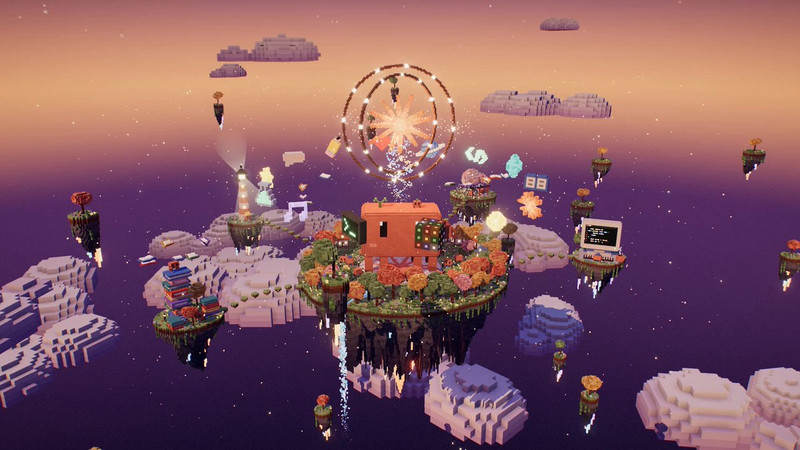

[← Back to gallery](../browse/characters.en.md) · [简体中文](2105804692811137242.md)

# A model self-portrait in a floating voxel world

**[bluedev · @blueemi99](https://x.com/blueemi99)** · Pixel art & characters · 26s

> Discovery pool · Source verified; catalog details being completed.

**[▶ Open gallery to play](https://guanmo-ai.github.io/awesome-ai-motion/?lang=en#case-2105804692811137242)** · [Original post](https://x.com/blueemi99/status/2105804692811137242)

Click the cover to open the gallery and play.

A voxel world based on a model self-portrait, with floating islands, buildings and a central glowing ring. The creator qualifies the Fable 5.5 attribution with “maybe”; that version uncertainty is retained here.

No public prompt has been verified. [View the original post](https://x.com/blueemi99/status/2105804692811137242)

Bookmarks 213 · Likes 946 · Views 72,688

## Source record

- Original post: [@blueemi99](https://x.com/blueemi99/status/2105804692811137242) · 2026-10-01T23:38:57+00:00
- Model attribution: Claude (reported Fable 5.5; version unverified) · [Creator’s statement](https://x.com/blueemi99/status/2105804692811137242)
- Prompt lookup: [Creator post](https://x.com/blueemi99/status/2105804692811137242) · 2026-10-02 09:20 UTC
- Cover source: [Original cover source](https://pbs.twimg.com/amplify_video_thumb/2105804425365254144/img/ObHtBHb8X5tBbFtB.jpg)
- Metrics snapshot: [Original X post](https://x.com/blueemi99/status/2105804692811137242) · 2026-10-02 09:20 UTC
- Gallery video source: [Original post media record](https://x.com/blueemi99/status/2105804692811137242) · 2026-10-02 09:20 UTC · Post/media correspondence and media response checked; external reference, no re-upload

Model attribution is based on creator statements. Prompts have not been independently rerun; sound and visuals have not received a uniform quality rating. Videos reference original post media, not our uploads; redistribution permission has not been verified.
