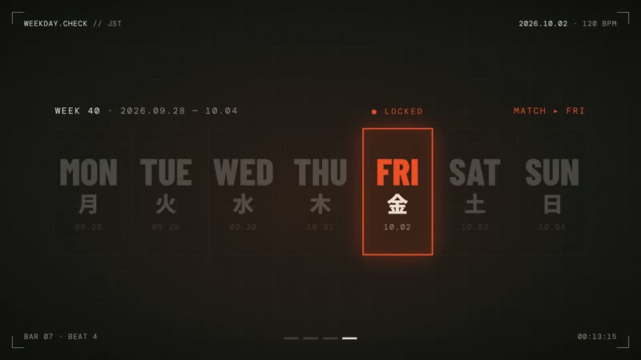

[← Back to gallery](../browse/motion.en.md) · [简体中文](2105917770907156748.md)

# A thirty-second motion answer to the day of the week

**[kazu@生成AI×教育 · @tankazunori0914](https://x.com/tankazunori0914)** · Motion design · 30s

**[▶ Open gallery to play](https://guanmo-ai.github.io/awesome-ai-motion/?lang=en#case-2105917770907156748)** · [Original post](https://x.com/tankazunori0914/status/2105917770907156748)

Click the cover to open the gallery and play.

The creator publishes a prompt asking for a thirty-second motion-graphics answer to the day of the week with BGM, and lists Opus 5.5, HyperFrames and Python-synthesized music.

The creator has shared instructions; this catalog links to the source without redistributing the full text or translation. [Read the creator’s original](https://x.com/tankazunori0914/status/2105917770907156748)

Bookmarks 16 · Likes 25 · Views 5,080

## Source record

- Original post: [@tankazunori0914](https://x.com/tankazunori0914/status/2105917770907156748) · 2026-10-02T07:08:17+00:00
- Model attribution: Opus 5.5 · [Creator’s statement](https://x.com/tankazunori0914/status/2105917770907156748)
- Prompt source: [Creator post](https://x.com/tankazunori0914/status/2105917770907156748) · 2026-10-09 17:00 UTC
- Cover source: [Original cover source](https://x.com/tankazunori0914/status/2105917770907156748) · 13.5s
- Metrics snapshot: [Original X post](https://x.com/tankazunori0914/status/2105917770907156748) · 2026-10-09 17:00 UTC
- Gallery video source: [Original post media record](https://x.com/tankazunori0914/status/2105917770907156748) · 2026-10-09 17:01 UTC · Post/media correspondence and media response checked; external reference, no re-upload

Model attribution is based on creator statements. Prompts have not been independently rerun; sound and visuals have not received a uniform quality rating. Videos reference original post media, not our uploads; redistribution permission has not been verified.
