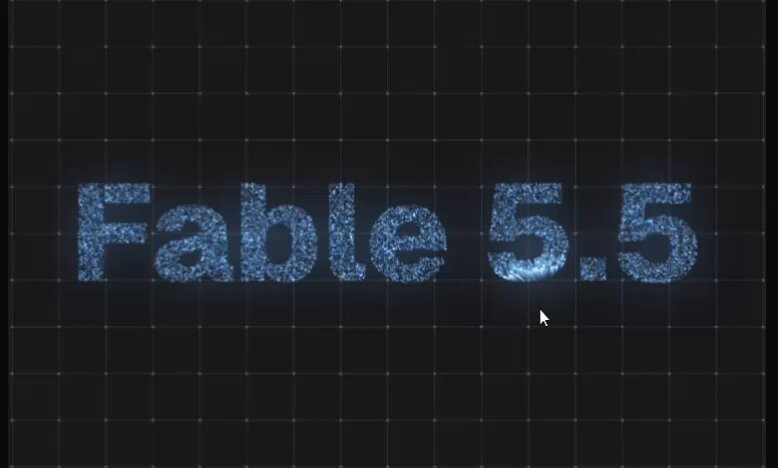

[← Back to gallery](../browse/motion.en.md) · [简体中文](2106040056616239235.md)

# Particle typography: Opus animation and Fable text

**[Manuel · @mszzz0011](https://x.com/mszzz0011)** · Motion design · 20s

> Discovery pool · Source verified; catalog details being completed.

**[▶ Open gallery to play](https://guanmo-ai.github.io/awesome-ai-motion/?lang=en#case-2106040056616239235)** · [Original post](https://x.com/mszzz0011/status/2106040056616239235)

Click the cover to open the gallery and play.

Particles form the words Fable 5.5 in an approximately 20-second motion piece. The post explicitly credits Opus 5.5 for animation and a reported Fable 5.5 for text. The depicted name is not official release information; the Fable version is unverified.

No public prompt has been verified. [View the original post](https://x.com/mszzz0011/status/2106040056616239235)

Bookmarks 0 · Likes 2 · Views 99

## Source record

- Original post: [@mszzz0011](https://x.com/mszzz0011/status/2106040056616239235) · 2026-10-02T15:14:12+00:00
- Model attribution: Claude Opus 5.5 / Claude (reported Fable 5.5; version unverified) · [Creator’s statement](https://x.com/mszzz0011/status/2106040056616239235)
- Prompt lookup: [Creator post](https://x.com/mszzz0011/status/2106040056616239235) · 2026-10-02 17:12 UTC
- Cover source: [Original cover source](https://pbs.twimg.com/amplify_video_thumb/2106039479148412928/img/zXGfqlV9eZFdpCs0.jpg)
- Metrics snapshot: [Original X post](https://x.com/mszzz0011/status/2106040056616239235) · 2026-10-02 17:12 UTC
- Gallery video source: [Original post media record](https://x.com/mszzz0011/status/2106040056616239235) · 2026-10-02 17:12 UTC · Post/media correspondence and media response checked; external reference, no re-upload

Model attribution is based on creator statements. Prompts have not been independently rerun; sound and visuals have not received a uniform quality rating. Videos reference original post media, not our uploads; redistribution permission has not been verified.
