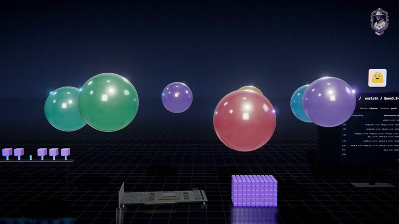

[← 返回图库](../browse/education.md) · [English](2106060741732147653.en.md)

# 用 3D 动画解释 AI 量化

**[Juleboost · @Juleboost3](https://x.com/Juleboost3)** · 知识讲解 · 71s

> 发现池 · 来源已核对，编目资料待完善。

**[▶ 打开画廊播放](https://guanmo-ai.github.io/awesome-ai-motion/#case-2106060741732147653)** · [作者原帖](https://x.com/Juleboost3/status/2106060741732147653)

点击封面打开画廊播放。

作者将 AI 模型量化原理制作成约 71 秒 3D 解释视频，并称由 Opus 5.5 制作。原帖链接对应 YouTube 作品；提示词需私信索取，未作为已公开原文收录。

未取得作者公开提示词。 [查看作者原帖](https://x.com/Juleboost3/status/2106060741732147653)

收藏 0 · 点赞 2 · 浏览 6

## 来源记录

- 作品原帖: [@Juleboost3](https://x.com/Juleboost3/status/2106060741732147653) · 2026-10-02T16:36:24+00:00
- 模型归因: Claude Opus 5.5 · [作者说明](https://x.com/Juleboost3/status/2106060741732147653)
- 提示词查阅记录: [作者原帖](https://x.com/Juleboost3/status/2106060741732147653) · 2026-10-02 17:12 UTC
- 封面来源: [原帖封面来源](https://pbs.twimg.com/amplify_video_thumb/2106060616125337600/img/fj8aU6zAUkDT445l.jpg)
- 互动快照: [X 原帖](https://x.com/Juleboost3/status/2106060741732147653) · 2026-10-02 17:12 UTC
- 画廊原视频: [原帖媒体记录](https://x.com/Juleboost3/status/2106060741732147653) · 2026-10-02 17:12 UTC · 已核对原帖媒体对应与媒体响应；外部引用，不重新上传

模型依据来自作者自述，未独立重跑提示词，也未对音画作统一质量评级。视频引用作者原帖媒体，未由本站重新上传，转载许可未确认。
