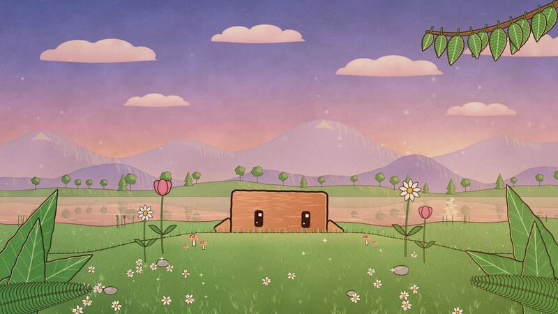

[← Back to gallery](../browse/characters.en.md) · [简体中文](2106061225851568278.md)

# A Claude Code mascot character short

**[Rishit Gupta 🗽 · @rishit30g](https://x.com/rishit30g)** · Pixel art & characters · 10s

**[▶ Open gallery to play](https://guanmo-ai.github.io/awesome-ai-motion/?lang=en#case-2106061225851568278)** · [Original post](https://x.com/rishit30g/status/2106061225851568278)

Click the cover to open the gallery and play.

The creator shares a ten-second mascot short and adds a reply listing Opus 5.5, HeyGen and Remotion skills, Node, ffmpeg and Python.

No public prompt has been verified. [View the original post](https://x.com/rishit30g/status/2106061225851568278)

Bookmarks 1 · Likes 1 · Views 116

## Source record

- Original post: [@rishit30g](https://x.com/rishit30g/status/2106061225851568278) · 2026-10-02T16:38:19+00:00
- Model attribution: Opus 5.5 · [Creator’s statement](https://x.com/rishit30g/status/2106061582195392941)
- Prompt lookup: [Creator post](https://x.com/rishit30g/status/2106061225851568278) · 2026-10-09 17:00 UTC
- Cover source: [Original cover source](https://pbs.twimg.com/amplify_video_thumb/2106059128150151168/img/OBtdztO8DkgWN1dn.jpg)
- Metrics snapshot: [Original X post](https://x.com/rishit30g/status/2106061225851568278) · 2026-10-09 17:00 UTC
- Gallery video source: [Original post media record](https://x.com/rishit30g/status/2106061225851568278) · 2026-10-09 17:01 UTC · Post/media correspondence and media response checked; external reference, no re-upload

Model attribution is based on creator statements. Prompts have not been independently rerun; sound and visuals have not received a uniform quality rating. Videos reference original post media, not our uploads; redistribution permission has not been verified.
