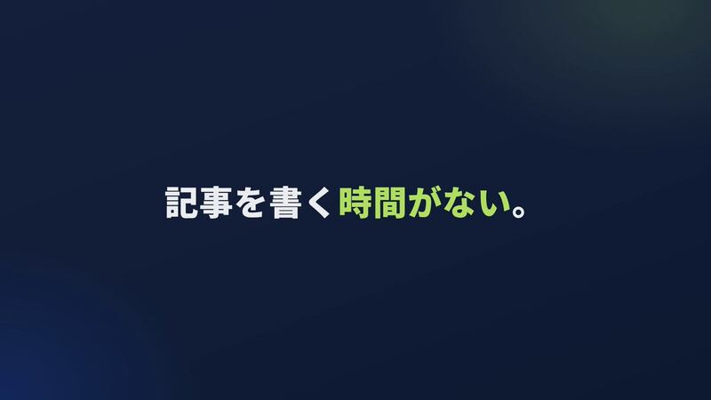

[← Back to gallery](../browse/product.en.md) · [简体中文](2106177888265576886.md)

# KotoSearch: from product browsing to narration sync

**[はじめ｜SEOツール「コトサーチ」 · @tetsu\_tetsu333](https://x.com/tetsu_tetsu333)** · Product & marketing · 52s

**[▶ Open gallery to play](https://guanmo-ai.github.io/awesome-ai-motion/?lang=en#case-2106177888265576886)** · [Original post](https://x.com/tetsu_tetsu333/status/2106177888265576886)

Click the cover to open the gallery and play.

The creator describes an SEO product launch workflow covering product browsing, specifications, screenshots, storyboarding, narration split into 32 segments, synchronized visuals, and code-generated music.

## What to learn

Reading the actual product first connects feature explanations, screenshots and narration timing.

**Try it yourself** · Editorial suggestions based on public source material, not a complete record of the creator’s process.

1. Browse the product, document its features and wording constraints, then choose screenshots.
2. Write a storyboard and narration, and inspect Remotion stills for text and layout.
3. Split narration into timed segments, align visuals and captions, and add music below the voice.

Tools mentioned in the source：Opus 5.5 · Gemini 3.8 Flash TTS · Remotion

[Source 1](https://x.com/tetsu_tetsu333/status/2106177888265576886)

Author brief · not the complete prompt. The complete instructions have not been verified; see the creator’s post. [View the original post](https://x.com/tetsu_tetsu333/status/2106177888265576886)

Bookmarks 3 · Likes 4 · Views 1,169

## Source record

- Original post: [@tetsu\_tetsu333](https://x.com/tetsu_tetsu333/status/2106177888265576886) · 2026-10-03T00:21:54+00:00
- Model attribution: Opus 5.5 · [Creator’s statement](https://x.com/tetsu_tetsu333/status/2106177888265576886)
- Prompt source: [Creator post](https://x.com/tetsu_tetsu333/status/2106177888265576886) · 2026-10-09 17:00 UTC
- Cover source: [Original cover source](https://pbs.twimg.com/amplify_video_thumb/2106177856074379264/img/XKWcOOU3aWzHZ9Un.jpg)
- Metrics snapshot: [Original X post](https://x.com/tetsu_tetsu333/status/2106177888265576886) · 2026-10-09 17:00 UTC
- Gallery video source: [Original post media record](https://x.com/tetsu_tetsu333/status/2106177888265576886) · 2026-10-09 17:01 UTC · Post/media correspondence and media response checked; external reference, no re-upload

Model attribution is based on creator statements. Prompts have not been independently rerun; sound and visuals have not received a uniform quality rating. Videos reference original post media, not our uploads; redistribution permission has not been verified.
