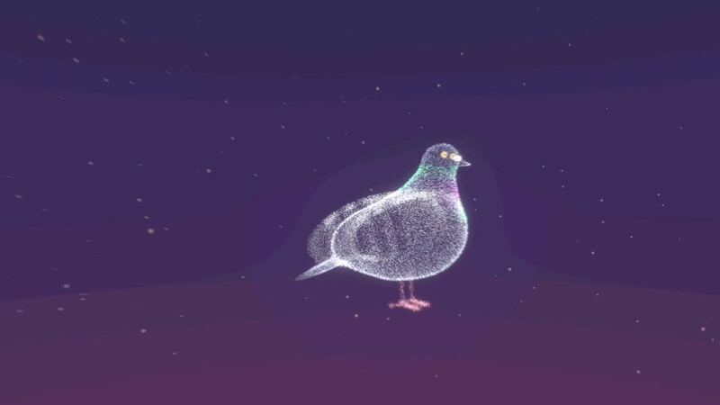

[← Back to gallery](../browse/music.en.md) · [简体中文](2106201281199284735.md)

# A pigeon music opening with word-level lyrics

**[FEEL YOU AI音楽映像クリエイター · @aijipusi75693](https://x.com/aijipusi75693)** · Music & lyrics · 40s

**[▶ Open gallery to play](https://guanmo-ai.github.io/awesome-ai-motion/?lang=en#case-2106201281199284735)** · [Original post](https://x.com/aijipusi75693/status/2106201281199284735)

Click the cover to open the gallery and play.

The creator uses Opus 5.5, Remotion and Three.js for a pigeon-themed opening with a Suno song, describing Claude’s word-by-word lyric timing.

Author brief · not the complete prompt. The complete instructions have not been verified; see the creator’s post. [View the original post](https://x.com/aijipusi75693/status/2106201281199284735)

Bookmarks 1 · Likes 6 · Views 845

## Source record

- Original post: [@aijipusi75693](https://x.com/aijipusi75693/status/2106201281199284735) · 2026-10-03T01:54:51+00:00
- Model attribution: Opus 5.5 · [Creator’s statement](https://x.com/aijipusi75693/status/2106201281199284735)
- Prompt source: [Creator post](https://x.com/aijipusi75693/status/2106201281199284735) · 2026-10-09 17:00 UTC
- Cover source: [Original cover source](https://pbs.twimg.com/amplify_video_thumb/2106199923142336512/img/n4UYUk6fZhStiHTs.jpg)
- Metrics snapshot: [Original X post](https://x.com/aijipusi75693/status/2106201281199284735) · 2026-10-09 17:00 UTC
- Gallery video source: [Original post media record](https://x.com/aijipusi75693/status/2106201281199284735) · 2026-10-09 17:01 UTC · Post/media correspondence and media response checked; external reference, no re-upload

Model attribution is based on creator statements. Prompts have not been independently rerun; sound and visuals have not received a uniform quality rating. Videos reference original post media, not our uploads; redistribution permission has not been verified.
