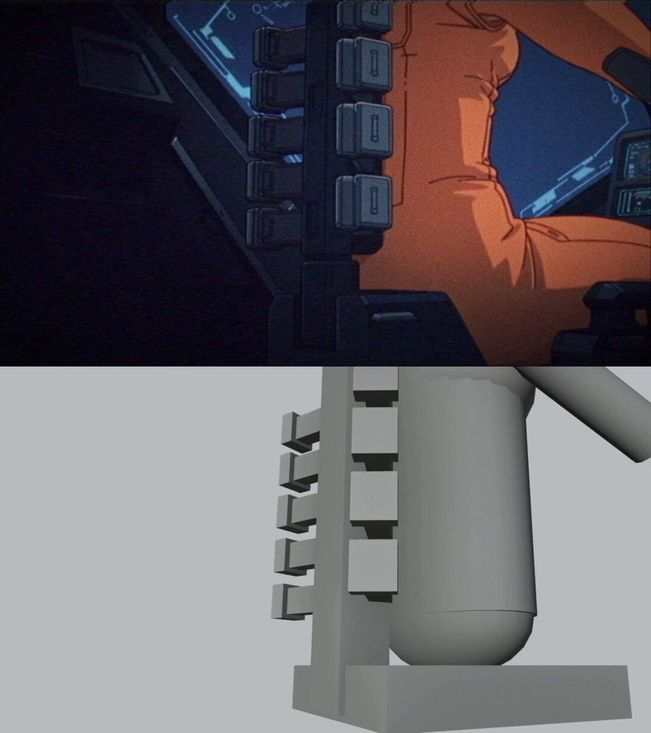

[← Back to gallery](../browse/stories.en.md) · [简体中文](2106466745661980904.md)

# Retro anime sequence with Blender and generated shots

**[A.I.Warper · @AIWarper](https://x.com/AIWarper)** · Narrative films · 25s

> Discovery pool · Source verified; catalog details being completed.

**[▶ Open gallery to play](https://guanmo-ai.github.io/awesome-ai-motion/?lang=en#case-2106466745661980904)** · [Original post](https://x.com/AIWarper/status/2106466745661980904)

Click the cover to open the gallery and play.

The creator shares a retro anime sequence made with Opus 5.5 and Blender MCP, Seedance 2.5, and Opus-driven DaVinci Resolve Studio. It is a mixed production workflow rather than an entirely code-rendered film.

No public prompt has been verified. [View the original post](https://x.com/AIWarper/status/2106466745661980904)

Bookmarks 1,577 · Likes 2,087 · Views 240,366

## Source record

- Original post: [@AIWarper](https://x.com/AIWarper/status/2106466745661980904) · 2026-10-03T19:29:43+00:00
- Model attribution: Claude Opus 5.5 + Seedance 2.5 · [Creator’s statement](https://x.com/AIWarper/status/2106466745661980904)
- Prompt lookup: [Creator post](https://x.com/AIWarper/status/2106466745661980904) · 2026-10-04 08:18 UTC
- Cover source: [Original cover source](https://pbs.twimg.com/amplify_video_thumb/2106464555870113792/img/Pci3ypStejmoTBq0.jpg)
- Metrics snapshot: [Original X post](https://x.com/AIWarper/status/2106466745661980904) · 2026-10-04 08:18 UTC
- Gallery video source: [Original post media record](https://x.com/AIWarper/status/2106466745661980904) · 2026-10-04 08:18 UTC · Post/media correspondence and media response checked; external reference, no re-upload

Model attribution is based on creator statements. Prompts have not been independently rerun; sound and visuals have not received a uniform quality rating. Videos reference original post media, not our uploads; redistribution permission has not been verified.
