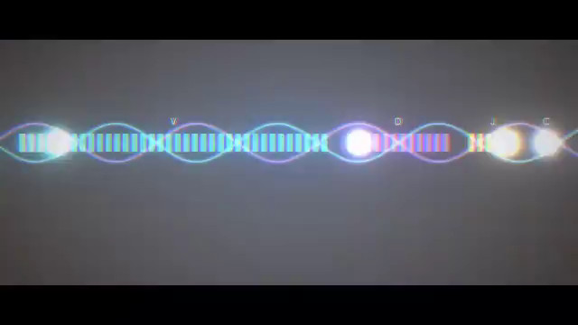

[← Back to gallery](../browse/education.en.md) · [简体中文](2106567073149190228.md)

# A code-animated history of immunology

**[Derya Unutmaz, MD · @DeryaTR\_](https://x.com/DeryaTR_)** · Education & explainers · 120s

> Discovery pool · Source verified; catalog details being completed.

**[▶ Open gallery to play](https://guanmo-ai.github.io/awesome-ai-motion/?lang=en#case-2106567073149190228)** · [Original post](https://x.com/DeryaTR_/status/2106567073149190228)

Click the cover to open the gallery and play.

A two-minute history-of-immunology animation uses code-generated visuals and music.

Author brief · not the complete prompt. The complete instructions have not been verified; see the creator’s post. [View the original post](https://x.com/DeryaTR_/status/2106567073149190228)

Bookmarks 135 · Likes 435 · Views 24,238

## Source record

- Original post: [@DeryaTR\_](https://x.com/DeryaTR_/status/2106567073149190228) · 2026-10-04T02:08:23+00:00
- Model attribution: Claude Opus 5.5 · [Creator’s statement](https://x.com/DeryaTR_/status/2106567073149190228)
- Prompt source: [Creator post](https://x.com/DeryaTR_/status/2106567073149190228) · 2026-10-06 16:07 UTC
- Cover source: [Original cover source](https://x.com/DeryaTR_/status/2106567073149190228) · 70s
- Metrics snapshot: [Original X post](https://x.com/DeryaTR_/status/2106567073149190228) · 2026-10-06 16:07 UTC
- Gallery video source: [Original post media record](https://x.com/DeryaTR_/status/2106567073149190228) · 2026-10-06 16:07 UTC · Post/media correspondence and media response checked; external reference, no re-upload

Model attribution is based on creator statements. Prompts have not been independently rerun; sound and visuals have not received a uniform quality rating. Videos reference original post media, not our uploads; redistribution permission has not been verified.
