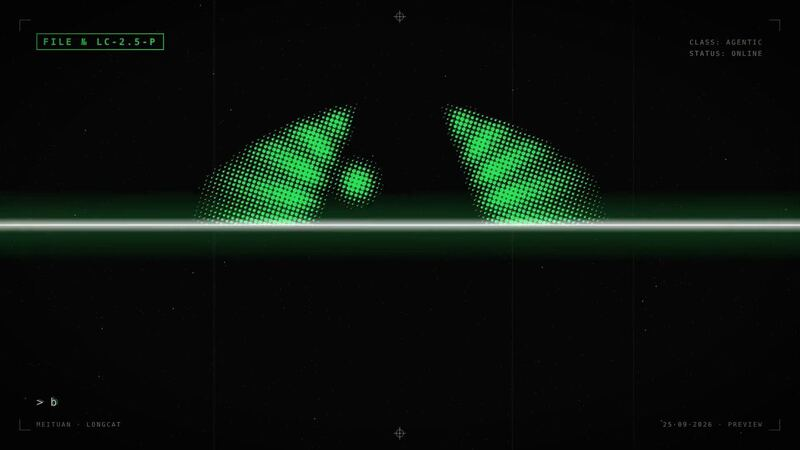

[← Back to gallery](../browse/product.en.md) · [简体中文](2106666146456125931.md)

# LongCat: a halftone launch film led by cat eyes

**[Leo · @LeowenAI](https://x.com/LeowenAI)** · Product & marketing · 25s

**[▶ Open gallery to play](https://guanmo-ai.github.io/awesome-ai-motion/?lang=en#case-2106666146456125931)** · [Original post](https://x.com/LeowenAI/status/2106666146456125931)

Click the cover to open the gallery and play.

The creator made a LongCat launch film with Opus 5.5, Remotion and Python-generated music, describing animated cat eyes that respond to typing and beats before resolving into the logo through repeated revisions.

## What to learn

Carrying one character feature across scenes gives iterations a clear visual anchor.

**Try it yourself** · Editorial suggestions based on public source material, not a complete record of the creator’s process.

1. List the typing, beat and gaze events that the cat eyes should respond to.
2. Arrange those events in Remotion against the Python-generated music.
3. Review the actions and logo transition in passes, then revise from playback feedback.

Tools mentioned in the source：Opus 5.5 · Remotion · Python

[Source 1](https://x.com/LeowenAI/status/2106666146456125931)

Author brief · not the complete prompt. The complete instructions have not been verified; see the creator’s post. [View the original post](https://x.com/LeowenAI/status/2106666146456125931)

Bookmarks 3 · Likes 7 · Views 543

## Source record

- Original post: [@LeowenAI](https://x.com/LeowenAI/status/2106666146456125931) · 2026-10-04T08:42:03+00:00
- Model attribution: Opus 5.5 · [Creator’s statement](https://x.com/LeowenAI/status/2106666146456125931)
- Prompt source: [Creator post](https://x.com/LeowenAI/status/2106666146456125931) · 2026-10-09 17:00 UTC
- Cover source: [Original cover source](https://pbs.twimg.com/amplify_video_thumb/2106665979514339328/img/StDOGRM7-0NjHKEy.jpg)
- Metrics snapshot: [Original X post](https://x.com/LeowenAI/status/2106666146456125931) · 2026-10-09 17:00 UTC
- Gallery video source: [Original post media record](https://x.com/LeowenAI/status/2106666146456125931) · 2026-10-09 17:00 UTC · Post/media correspondence and media response checked; external reference, no re-upload

Model attribution is based on creator statements. Prompts have not been independently rerun; sound and visuals have not received a uniform quality rating. Videos reference original post media, not our uploads; redistribution permission has not been verified.
