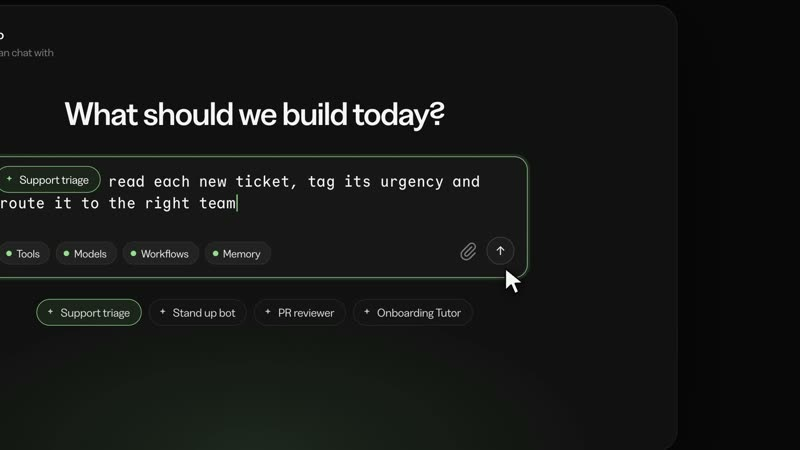

[← Back to gallery](../browse/motion.en.md) · [简体中文](2107225121123402052.md)

# A single-prompt HyperFrames motion experiment

**[Kzm · @kzmucx](https://x.com/kzmucx)** · Motion design · 24s

**[▶ Open gallery to play](https://guanmo-ai.github.io/awesome-ai-motion/?lang=en#case-2107225121123402052)** · [Original post](https://x.com/kzmucx/status/2107225121123402052)

Click the cover to open the gallery and play.

The creator presents a HyperFrames Studio video made using a single Opus 5.5 prompt. The complete instruction has not been verified.

No public prompt has been verified. [View the original post](https://x.com/kzmucx/status/2107225121123402052)

Bookmarks 0 · Likes 3 · Views 61

## Source record

- Original post: [@kzmucx](https://x.com/kzmucx/status/2107225121123402052) · 2026-10-05T21:43:13+00:00
- Model attribution: Opus 5.5 · [Creator’s statement](https://x.com/kzmucx/status/2107225121123402052)
- Prompt lookup: [Creator post](https://x.com/kzmucx/status/2107225121123402052) · 2026-10-09 17:00 UTC
- Cover source: [Original cover source](https://x.com/kzmucx/status/2107225121123402052) · 10.575s
- Metrics snapshot: [Original X post](https://x.com/kzmucx/status/2107225121123402052) · 2026-10-09 17:00 UTC
- Gallery video source: [Original post media record](https://x.com/kzmucx/status/2107225121123402052) · 2026-10-09 17:00 UTC · Post/media correspondence and media response checked; external reference, no re-upload

Model attribution is based on creator statements. Prompts have not been independently rerun; sound and visuals have not received a uniform quality rating. Videos reference original post media, not our uploads; redistribution permission has not been verified.
