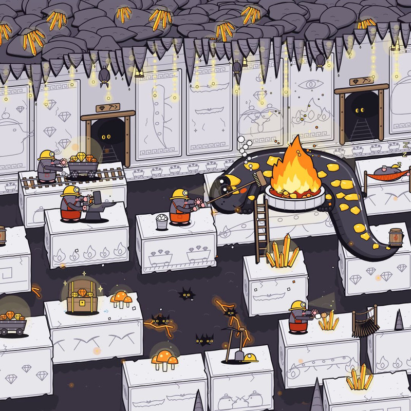

[← Back to gallery](../browse/characters.en.md) · [简体中文](2107235777029476636.md)

# A cozy animation from a personal drawing

**[magnum opus · @opusultra](https://x.com/opusultra)** · Pixel art & characters · 12s

> Discovery pool · Source verified; catalog details being completed.

**[▶ Open gallery to play](https://guanmo-ai.github.io/awesome-ai-motion/?lang=en#case-2107235777029476636)** · [Original post](https://x.com/opusultra/status/2107235777029476636)

Click the cover to open the gallery and play.

The creator's drawing becomes a cozy kitchen animation with moving characters and objects.

Author brief · not the complete prompt. The complete instructions have not been verified; see the creator’s post. [View the original post](https://x.com/opusultra/status/2107235777029476636)

Bookmarks 0 · Likes 1 · Views 15

## Source record

- Original post: [@opusultra](https://x.com/opusultra/status/2107235777029476636) · 2026-10-05T22:25:34+00:00
- Model attribution: Claude Opus 5.5 · [Creator’s statement](https://x.com/opusultra/status/2107235777029476636)
- Prompt source: [Creator post](https://x.com/opusultra/status/2107235777029476636) · 2026-10-06 16:08 UTC
- Cover source: [Original cover source](https://pbs.twimg.com/amplify_video_thumb/2107235744494346240/img/n68Ji0SDd9h-A5pS.jpg)
- Metrics snapshot: [Original X post](https://x.com/opusultra/status/2107235777029476636) · 2026-10-06 16:08 UTC
- Gallery video source: [Original post media record](https://x.com/opusultra/status/2107235777029476636) · 2026-10-06 16:08 UTC · Post/media correspondence and media response checked; external reference, no re-upload

Model attribution is based on creator statements. Prompts have not been independently rerun; sound and visuals have not received a uniform quality rating. Videos reference original post media, not our uploads; redistribution permission has not been verified.
