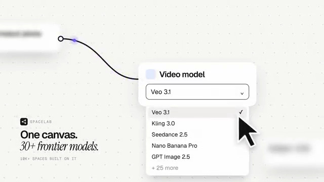

[← 返回图库](../browse/product.md) · [English](2107367341973717334.en.md)

# 个人简历的 HTML 动态作品集

**[shashwa7 · @offcod8](https://x.com/offcod8)** · 产品宣传 · 41s

> 发现池 · 来源已核对，编目资料待完善。

**[▶ 打开画廊播放](https://guanmo-ai.github.io/awesome-ai-motion/#case-2107367341973717334)** · [作者原帖](https://x.com/offcod8/status/2107367341973717334)

点击封面打开画廊播放。

用网页界面、产品展示和文字节奏组织个人作品集，作者说明画面与音乐来自代码。

作者任务描述 · 非完整提示词。完整指令尚未取得，请查看作者原帖。 [查看作者原帖](https://x.com/offcod8/status/2107367341973717334)

收藏 0 · 点赞 4 · 浏览 263

## 来源记录

- 作品原帖: [@offcod8](https://x.com/offcod8/status/2107367341973717334) · 2026-10-06T07:08:21+00:00
- 模型归因: Claude Opus 5.5 · [作者说明](https://x.com/offcod8/status/2107367341973717334)
- 提示词出处: [作者原帖](https://x.com/offcod8/status/2107367341973717334) · 2026-10-06 16:07 UTC
- 封面来源: [原帖封面来源](https://x.com/offcod8/status/2107367341973717334) · 13.67s
- 互动快照: [X 原帖](https://x.com/offcod8/status/2107367341973717334) · 2026-10-06 16:07 UTC
- 画廊原视频: [原帖媒体记录](https://x.com/offcod8/status/2107367341973717334) · 2026-10-06 16:07 UTC · 已核对原帖媒体对应与媒体响应；外部引用，不重新上传

模型依据来自作者自述，未独立重跑提示词，也未对音画作统一质量评级。视频引用作者原帖媒体，未由本站重新上传，转载许可未确认。
