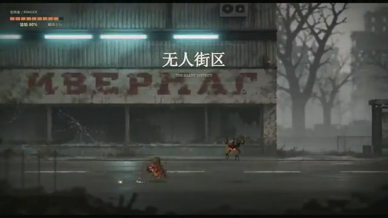

[← Back to gallery](../browse/characters.en.md) · [简体中文](2107399895011434935.md)

# ASHEN FRONTIER: a wasteland side-scroller

**[Rainy · @jiangjiangling](https://x.com/jiangjiangling)** · Pixel art & characters · 30s

> Discovery pool · Source verified; catalog details being completed.

**[▶ Open gallery to play](https://guanmo-ai.github.io/awesome-ai-motion/?lang=en#case-2107399895011434935)** · [Original post](https://x.com/jiangjiangling/status/2107399895011434935)

Click the cover to open the gallery and play.

A Canvas 2D wasteland action game accompanies a detailed world, character and combat prompt.

The creator has shared instructions; this catalog links to the source without redistributing the full text or translation. [Read the creator’s original](https://x.com/jiangjiangling/status/2107399895011434935)

Bookmarks 2 · Likes 4 · Views 2,095

## Source record

- Original post: [@jiangjiangling](https://x.com/jiangjiangling/status/2107399895011434935) · 2026-10-06T09:17:43+00:00
- Model attribution: Codex（版本未注明） · [Creator’s statement](https://x.com/jiangjiangling/status/2107399895011434935)
- Prompt source: [Creator post](https://x.com/jiangjiangling/status/2107399895011434935) · 2026-10-06 16:07 UTC
- Cover source: [Original cover source](https://x.com/jiangjiangling/status/2107399895011434935) · 10s
- Metrics snapshot: [Original X post](https://x.com/jiangjiangling/status/2107399895011434935) · 2026-10-06 16:07 UTC
- Gallery video source: [Original post media record](https://x.com/jiangjiangling/status/2107399895011434935) · 2026-10-06 16:07 UTC · Post/media correspondence and media response checked; external reference, no re-upload

Model attribution is based on creator statements. Prompts have not been independently rerun; sound and visuals have not received a uniform quality rating. Videos reference original post media, not our uploads; redistribution permission has not been verified.
