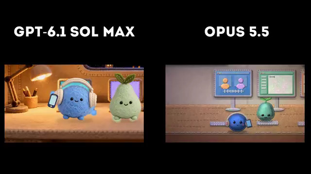

[← Back to gallery](../browse/motion.en.md) · [简体中文](2107443775232438381.md)

# An OpenAI-dot character comparison

**[kepo · @kepochnik](https://x.com/kepochnik)** · Motion design · 18s

> Discovery pool · Source verified; catalog details being completed.

**[▶ Open gallery to play](https://guanmo-ai.github.io/awesome-ai-motion/?lang=en#case-2107443775232438381)** · [Original post](https://x.com/kepochnik/status/2107443775232438381)

Click the cover to open the gallery and play.

Two outputs from a shared dot-character animation task are shown side by side.

Author brief · not the complete prompt. The complete instructions have not been verified; see the creator’s post. [View the original post](https://x.com/kepochnik/status/2107443775232438381)

Bookmarks 11 · Likes 69 · Views 6,316

## Source record

- Original post: [@kepochnik](https://x.com/kepochnik/status/2107443775232438381) · 2026-10-06T12:12:05+00:00
- Model attribution: GPT-6.1 Sol Max、Claude Opus 5.5 · [Creator’s statement](https://x.com/kepochnik/status/2107443775232438381)
- Prompt source: [Creator post](https://x.com/kepochnik/status/2107443775232438381) · 2026-10-06 16:08 UTC
- Cover source: [Original cover source](https://x.com/kepochnik/status/2107443775232438381) · 6s
- Metrics snapshot: [Original X post](https://x.com/kepochnik/status/2107443775232438381) · 2026-10-06 16:08 UTC
- Gallery video source: [Original post media record](https://x.com/kepochnik/status/2107443775232438381) · 2026-10-06 16:08 UTC · Post/media correspondence and media response checked; external reference, no re-upload

Model attribution is based on creator statements. Prompts have not been independently rerun; sound and visuals have not received a uniform quality rating. Videos reference original post media, not our uploads; redistribution permission has not been verified.
