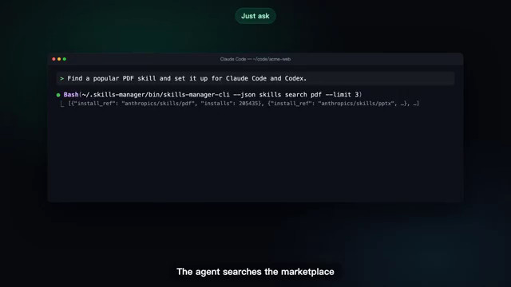

[← Back to gallery](../browse/product.en.md) · [简体中文](2107453817071804670.md)

# Skills Manager: discovery and installation

**[Jay.TL · @JayTL00](https://x.com/JayTL00)** · Product & marketing · 84s

> Discovery pool · Source verified; catalog details being completed.

**[▶ Open gallery to play](https://guanmo-ai.github.io/awesome-ai-motion/?lang=en#case-2107453817071804670)** · [Original post](https://x.com/JayTL00/status/2107453817071804670)

Click the cover to open the gallery and play.

Terminal scenes and step descriptions introduce skill discovery and installation.

No public prompt has been verified. [View the original post](https://x.com/JayTL00/status/2107453817071804670)

Bookmarks 0 · Likes 0 · Views 8

## Source record

- Original post: [@JayTL00](https://x.com/JayTL00/status/2107453817071804670) · 2026-10-06T12:51:59+00:00
- Model attribution: Claude Opus 5.5 · [Creator’s statement](https://x.com/JayTL00/status/2107453817071804670)
- Prompt lookup: [Creator post](https://x.com/JayTL00/status/2107453817071804670) · 2026-10-06 16:07 UTC
- Cover source: [Original cover source](https://x.com/JayTL00/status/2107453817071804670) · 27.9s
- Metrics snapshot: [Original X post](https://x.com/JayTL00/status/2107453817071804670) · 2026-10-06 16:07 UTC
- Gallery video source: [Original post media record](https://x.com/JayTL00/status/2107453817071804670) · 2026-10-06 16:07 UTC · Post/media correspondence and media response checked; external reference, no re-upload

Model attribution is based on creator statements. Prompts have not been independently rerun; sound and visuals have not received a uniform quality rating. Videos reference original post media, not our uploads; redistribution permission has not been verified.
