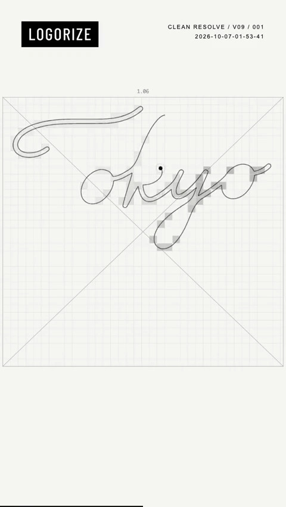

[← 返回图库](../browse/product.md) · [English](2107534435969360076.en.md)

# Tokyo Coffee Logo 过程宣传

**[Fine Code · @FineCodex](https://x.com/FineCodex)** · 产品宣传 · 8s

> 发现池 · 来源已核对，编目资料待完善。

**[▶ 打开画廊播放](https://guanmo-ai.github.io/awesome-ai-motion/#case-2107534435969360076)** · [作者原帖](https://x.com/FineCodex/status/2107534435969360076)

点击封面打开画廊播放。

作者为 LOGORIZE 展示从草图到 Logo 过程视频的宣传样片，并说明 Logo 定稿后可再要求生成过程片。

未取得作者公开提示词。 [查看作者原帖](https://x.com/FineCodex/status/2107534435969360076)

收藏 0 · 点赞 0 · 浏览 31

## 来源记录

- 作品原帖: [@FineCodex](https://x.com/FineCodex/status/2107534435969360076) · 2026-10-06T18:12:20+00:00
- 模型归因: Codex / LOGORIZE · [作者说明](https://x.com/FineCodex/status/2107534435969360076)
- 提示词查阅记录: [作者原帖](https://x.com/FineCodex/status/2107534435969360076) · 2026-10-07 04:03 UTC
- 封面来源: [原帖封面来源](https://x.com/FineCodex/status/2107534435969360076) · 4s
- 互动快照: [X 原帖](https://x.com/FineCodex/status/2107534435969360076) · 2026-10-07 04:03 UTC
- 画廊原视频: [原帖媒体记录](https://x.com/FineCodex/status/2107534435969360076) · 2026-10-07 04:03 UTC · 已核对原帖媒体对应与媒体响应；外部引用，不重新上传

模型依据来自作者自述，未独立重跑提示词，也未对音画作统一质量评级。视频引用作者原帖媒体，未由本站重新上传，转载许可未确认。
