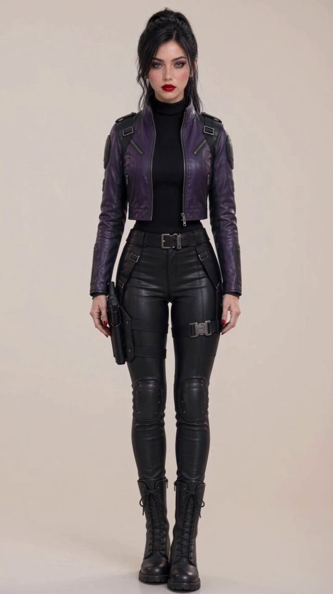

[← 返回图库](../browse/characters.md) · [English](2107541364841820482.en.md)

# Neon Shadows 角色服装转身测试

**[FemGCP · @JaviRandomXI](https://x.com/JaviRandomXI)** · 角色动画 · 5s

> 发现池 · 来源已核对，编目资料待完善。

**[▶ 打开画廊播放](https://guanmo-ai.github.io/awesome-ai-motion/#case-2107541364841820482)** · [作者原帖](https://x.com/JaviRandomXI/status/2107541364841820482)

点击封面打开画廊播放。

作者用 Seedance 2.5 测试自己的 FemGCP 角色新服装，画面展示黑红造型与半圈转身。

未取得作者公开提示词。 [查看作者原帖](https://x.com/JaviRandomXI/status/2107541364841820482)

收藏 1 · 点赞 1 · 浏览 33

## 来源记录

- 作品原帖: [@JaviRandomXI](https://x.com/JaviRandomXI/status/2107541364841820482) · 2026-10-06T18:39:52+00:00
- 模型归因: Seedance 2.5 · [作者说明](https://x.com/JaviRandomXI/status/2107541364841820482)
- 提示词查阅记录: [作者原帖](https://x.com/JaviRandomXI/status/2107541364841820482) · 2026-10-08 14:28 UTC
- 封面来源: [原帖封面来源](https://pbs.twimg.com/amplify_video_thumb/2107537544556519425/img/bnoCHuf4zhRHJKhu.jpg)
- 互动快照: [X 原帖](https://x.com/JaviRandomXI/status/2107541364841820482) · 2026-10-08 14:28 UTC
- 画廊原视频: [原帖媒体记录](https://x.com/JaviRandomXI/status/2107541364841820482) · 2026-10-08 14:28 UTC · 已核对原帖媒体对应与媒体响应；外部引用，不重新上传

模型依据来自作者自述，未独立重跑提示词，也未对音画作统一质量评级。视频引用作者原帖媒体，未由本站重新上传，转载许可未确认。
