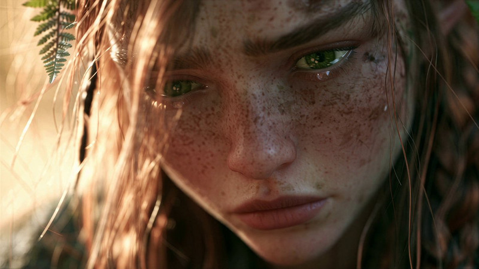

[← Back to gallery](../browse/stories.en.md) · [简体中文](2107546432324452844.md)

# The Last Goodbye

**[DrSadek · @DrSadek\_](https://x.com/DrSadek_)** · Narrative films · 30s

> Discovery pool · Source verified; catalog details being completed.

**[▶ Open gallery to play](https://guanmo-ai.github.io/awesome-ai-motion/?lang=en#case-2107546432324452844)** · [Original post](https://x.com/DrSadek_/status/2107546432324452844)

Click the cover to open the gallery and play.

The creator releases The Last Goodbye, credited to Seedance 2.5 on PixVerse.

No public prompt has been verified. [View the original post](https://x.com/DrSadek_/status/2107546432324452844)

Bookmarks 6 · Likes 62 · Views 1,246

## Source record

- Original post: [@DrSadek\_](https://x.com/DrSadek_/status/2107546432324452844) · 2026-10-06T19:00:00+00:00
- Model attribution: Seedance 2.5 · [Creator’s statement](https://x.com/DrSadek_/status/2107546432324452844)
- Prompt lookup: [Creator post](https://x.com/DrSadek_/status/2107546432324452844) · 2026-10-07 04:03 UTC
- Cover source: [Original cover source](https://pbs.twimg.com/amplify_video_thumb/2106051000687607808/img/v3wgDlwz26HJJDzr.jpg)
- Metrics snapshot: [Original X post](https://x.com/DrSadek_/status/2107546432324452844) · 2026-10-07 04:03 UTC
- Gallery video source: [Original post media record](https://x.com/DrSadek_/status/2107546432324452844) · 2026-10-07 04:03 UTC · Post/media correspondence and media response checked; external reference, no re-upload

Model attribution is based on creator statements. Prompts have not been independently rerun; sound and visuals have not received a uniform quality rating. Videos reference original post media, not our uploads; redistribution permission has not been verified.
