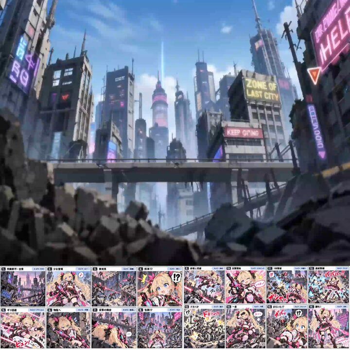

[← Back to gallery](../browse/stories.en.md) · [简体中文](2107605242712064361.md)

# From storyboard to futuristic city combat

**[さがみあーと／AIで想いを表現 · @sagami\_ss\_dev](https://x.com/sagami_ss_dev)** · Narrative films · 20s

> Discovery pool · Source verified; catalog details being completed.

**[▶ Open gallery to play](https://guanmo-ai.github.io/awesome-ai-motion/?lang=en#case-2107605242712064361)** · [Original post](https://x.com/sagami_ss_dev/status/2107605242712064361)

Click the cover to open the gallery and play.

The creator develops a storyboard with GPT-6.1 Sol and generates a futuristic-city combat sequence with Seedance, aiming for action and comedy.

Author brief · not the complete prompt. The complete instructions have not been verified; see the creator’s post. [View the original post](https://x.com/sagami_ss_dev/status/2107605242712064361)

Bookmarks 0 · Likes 2 · Views 32

## Source record

- Original post: [@sagami\_ss\_dev](https://x.com/sagami_ss_dev/status/2107605242712064361) · 2026-10-06T22:53:41+00:00
- Model attribution: GPT-6.1 Sol + Seedance · [Creator’s statement](https://x.com/sagami_ss_dev/status/2107605242712064361)
- Prompt source: [Creator post](https://x.com/sagami_ss_dev/status/2107605242712064361) · 2026-10-07 04:03 UTC
- Cover source: [Original cover source](https://pbs.twimg.com/amplify_video_thumb/2107604762686582784/img/OcjulK541sCT7CmZ.jpg)
- Metrics snapshot: [Original X post](https://x.com/sagami_ss_dev/status/2107605242712064361) · 2026-10-07 04:03 UTC
- Gallery video source: [Original post media record](https://x.com/sagami_ss_dev/status/2107605242712064361) · 2026-10-07 04:03 UTC · Post/media correspondence and media response checked; external reference, no re-upload

Model attribution is based on creator statements. Prompts have not been independently rerun; sound and visuals have not received a uniform quality rating. Videos reference original post media, not our uploads; redistribution permission has not been verified.
