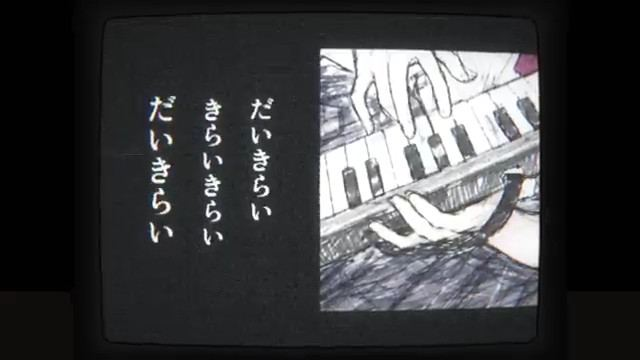

[← 返回图库](../browse/music.md) · [English](2107611329137971317.en.md)

# 单图驱动的复古电视音乐影像

**[HIRO · @SousakujikkenH](https://x.com/SousakujikkenH)** · 音乐与歌词 · 217s

> 发现池 · 来源已核对，编目资料待完善。

**[▶ 打开画廊播放](https://guanmo-ai.github.io/awesome-ai-motion/#case-2107611329137971317)** · [作者原帖](https://x.com/SousakujikkenH/status/2107611329137971317)

点击封面打开画廊播放。

作者用 Utabista 与 Opus 5.5 将一张图像制作成音乐视频，并说明工具用于微调时机和修正细节。

未取得作者公开提示词。 [查看作者原帖](https://x.com/SousakujikkenH/status/2107611329137971317)

收藏 0 · 点赞 2 · 浏览 120

## 来源记录

- 作品原帖: [@SousakujikkenH](https://x.com/SousakujikkenH/status/2107611329137971317) · 2026-10-06T23:17:53+00:00
- 模型归因: Claude Opus 5.5 · [作者说明](https://x.com/SousakujikkenH/status/2107611329137971317)
- 提示词查阅记录: [作者原帖](https://x.com/SousakujikkenH/status/2107611329137971317) · 2026-10-08 14:28 UTC
- 封面来源: [原帖封面来源](https://x.com/SousakujikkenH/status/2107611329137971317) · 20s
- 互动快照: [X 原帖](https://x.com/SousakujikkenH/status/2107611329137971317) · 2026-10-08 14:28 UTC
- 画廊原视频: [原帖媒体记录](https://x.com/SousakujikkenH/status/2107611329137971317) · 2026-10-08 14:28 UTC · 已核对原帖媒体对应与媒体响应；外部引用，不重新上传

模型依据来自作者自述，未独立重跑提示词，也未对音画作统一质量评级。视频引用作者原帖媒体，未由本站重新上传，转载许可未确认。
