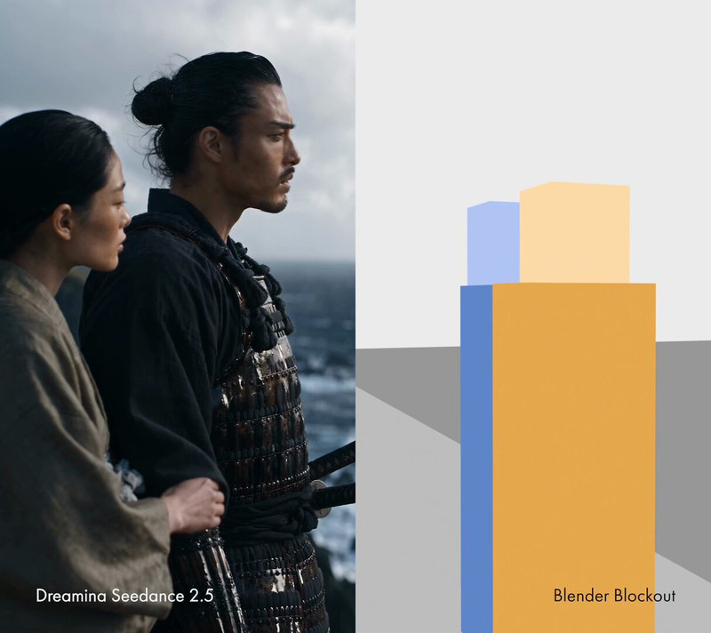

[← Back to gallery](../browse/stories.en.md) · [简体中文](2107676101749453177.md)

# Blender blockouts directing generated shots

**[gensōFX · @gensoFX](https://x.com/gensoFX)** · Narrative films · 20s

> Discovery pool · Source verified; catalog details being completed.

**[▶ Open gallery to play](https://guanmo-ai.github.io/awesome-ai-motion/?lang=en#case-2107676101749453177)** · [Original post](https://x.com/gensoFX/status/2107676101749453177)

Click the cover to open the gallery and play.

The creator plans cameras and timing in Blender, then uses the blockout as a Seedance video reference. The post compares final shots with the gray-box sequence.

Author brief · not the complete prompt. The complete instructions have not been verified; see the creator’s post. [View the original post](https://x.com/gensoFX/status/2107676101749453177)

Bookmarks 0 · Likes 0 · Views 5

## Source record

- Original post: [@gensoFX](https://x.com/gensoFX/status/2107676101749453177) · 2026-10-07T03:35:16+00:00
- Model attribution: Blender + Seedance 2.5 · [Creator’s statement](https://x.com/gensoFX/status/2107676101749453177)
- Prompt source: [Creator post](https://x.com/gensoFX/status/2107676101749453177) · 2026-10-07 04:01 UTC
- Cover source: [Original cover source](https://pbs.twimg.com/amplify_video_thumb/2107676058560724992/img/X-3It36dT8AhI4fA.jpg)
- Metrics snapshot: [Original X post](https://x.com/gensoFX/status/2107676101749453177) · 2026-10-07 04:01 UTC
- Gallery video source: [Original post media record](https://x.com/gensoFX/status/2107676101749453177) · 2026-10-07 04:01 UTC · Post/media correspondence and media response checked; external reference, no re-upload

Model attribution is based on creator statements. Prompts have not been independently rerun; sound and visuals have not received a uniform quality rating. Videos reference original post media, not our uploads; redistribution permission has not been verified.
