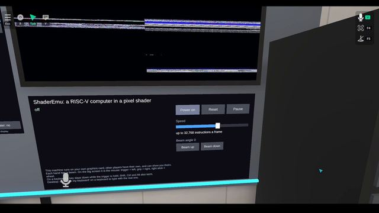

[← Back to gallery](../browse/interactive.en.md) · [简体中文](2107713497224130638.md)

# A Fragment-shader RISC-V Emulator in VRChat

**[Mykhailo Moroz · @Michael\_Moroz\_](https://x.com/Michael_Moroz_)** · 3D & interactive · 191s

> Discovery pool · Source verified; catalog details being completed.

**[▶ Open gallery to play](https://guanmo-ai.github.io/awesome-ai-motion/?lang=en#case-2107713497224130638)** · [Original post](https://x.com/Michael_Moroz_/status/2107713497224130638)

Click the cover to open the gallery and play.

A VRChat shader-emulator recording showing a window manager and Doom, optimized with Opus 5.5. Speed and iteration-time claims are author-reported.

No public prompt has been verified. [View the original post](https://x.com/Michael_Moroz_/status/2107713497224130638)

Bookmarks 163 · Likes 396 · Views 28,296

## Source record

- Original post: [@Michael\_Moroz\_](https://x.com/Michael_Moroz_/status/2107713497224130638) · 2026-10-07T06:03:51+00:00
- Model attribution: Claude Opus 5.5 · [Creator’s statement](https://x.com/Michael_Moroz_/status/2107713497224130638)
- Prompt lookup: [Creator post](https://x.com/Michael_Moroz_/status/2107713497224130638) · 2026-10-08 14:27 UTC
- Cover source: [Original cover source](https://pbs.twimg.com/amplify_video_thumb/2107711435937636352/img/KiRCJuKrhaC_KvNM.jpg)
- Metrics snapshot: [Original X post](https://x.com/Michael_Moroz_/status/2107713497224130638) · 2026-10-08 14:27 UTC
- Gallery video source: [Original post media record](https://x.com/Michael_Moroz_/status/2107713497224130638) · 2026-10-09 04:00 UTC · Post/media correspondence and media response checked; external reference, no re-upload

Model attribution is based on creator statements. Prompts have not been independently rerun; sound and visuals have not received a uniform quality rating. Videos reference original post media, not our uploads; redistribution permission has not been verified.
