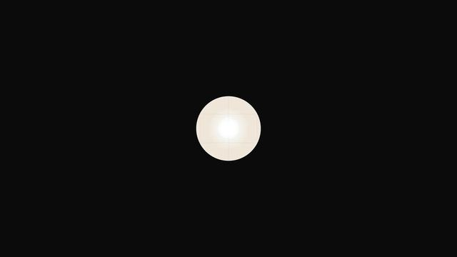

[← 返回图库](../browse/education.md) · [English](2108143447496679553.en.md)

# 十三分钟的诺贝尔奖讲解试片

**[MSB · @KeWai386772](https://x.com/KeWai386772)** · 知识讲解 · 780s

> 发现池 · 来源已核对，编目资料待完善。

**[▶ 打开画廊播放](https://guanmo-ai.github.io/awesome-ai-motion/#case-2108143447496679553)** · [作者原帖](https://x.com/KeWai386772/status/2108143447496679553)

点击封面打开画廊播放。

作者用 Claude Code 和 Opus 5.5 制作诺贝尔奖主题长讲解，并称提示词已分享；本轮未取得具体指令出处，不记录收益或传播预测为事实。

未取得作者公开提示词。 [查看作者原帖](https://x.com/KeWai386772/status/2108143447496679553)

收藏 0 · 点赞 0 · 浏览 125

## 来源记录

- 作品原帖: [@KeWai386772](https://x.com/KeWai386772/status/2108143447496679553) · 2026-10-08T10:32:19+00:00
- 模型归因: Claude Opus 5.5 · [作者说明](https://x.com/KeWai386772/status/2108143447496679553)
- 提示词查阅记录: [作者原帖](https://x.com/KeWai386772/status/2108143447496679553) · 2026-10-08 14:25 UTC
- 封面来源: [原帖封面来源](https://pbs.twimg.com/amplify_video_thumb/2108143214666584066/img/W3VfF4NQiYp95agv.jpg)
- 互动快照: [X 原帖](https://x.com/KeWai386772/status/2108143447496679553) · 2026-10-08 14:25 UTC
- 画廊原视频: [原帖媒体记录](https://x.com/KeWai386772/status/2108143447496679553) · 2026-10-08 14:25 UTC · 已核对原帖媒体对应与媒体响应；外部引用，不重新上传

模型依据来自作者自述，未独立重跑提示词，也未对音画作统一质量评级。视频引用作者原帖媒体，未由本站重新上传，转载许可未确认。
