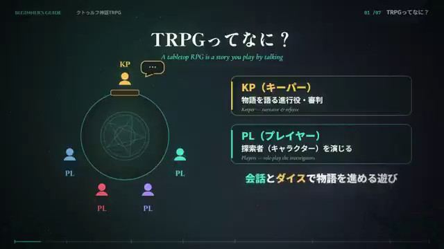

[← Back to gallery](../browse/education.en.md) · [简体中文](2108183474968654242.md)

# An Introduction to Cthulhu Mythos TRPGs

**[ギガビット@ゲームつくるひと · @gigabit\_million](https://x.com/gigabit_million)** · Education & explainers · 76s

> Discovery pool · Source verified; catalog details being completed.

**[▶ Open gallery to play](https://guanmo-ai.github.io/awesome-ai-motion/?lang=en#case-2108183474968654242)** · [Original post](https://x.com/gigabit_million/status/2108183474968654242)

Click the cover to open the gallery and play.

The creator asks Opus for an introductory video about unfamiliar Cthulhu Mythos tabletop role-playing games. The version is not specified.

Author brief · not the complete prompt. The complete instructions have not been verified; see the creator’s post. [View the original post](https://x.com/gigabit_million/status/2108183474968654242)

Bookmarks 0 · Likes 1 · Views 159

## Source record

- Original post: [@gigabit\_million](https://x.com/gigabit_million/status/2108183474968654242) · 2026-10-08T13:11:23+00:00
- Model attribution: Claude Opus（版本未说明） · [Creator’s statement](https://x.com/gigabit_million/status/2108183474968654242)
- Prompt source: [Creator post](https://x.com/gigabit_million/status/2108183474968654242) · 2026-10-08 14:25 UTC
- Cover source: [Original cover source](https://x.com/gigabit_million/status/2108183474968654242) · 10s
- Metrics snapshot: [Original X post](https://x.com/gigabit_million/status/2108183474968654242) · 2026-10-08 14:25 UTC
- Gallery video source: [Original post media record](https://x.com/gigabit_million/status/2108183474968654242) · 2026-10-08 14:25 UTC · Post/media correspondence and media response checked; external reference, no re-upload

Model attribution is based on creator statements. Prompts have not been independently rerun; sound and visuals have not received a uniform quality rating. Videos reference original post media, not our uploads; redistribution permission has not been verified.
