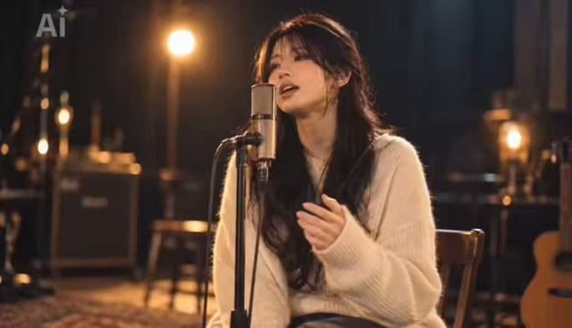

[← 返回图库](../browse/music.md) · [English](2108187050411483352.en.md)

# Suno 歌曲与 Seedance 演唱试验

**[あゆり · @ayuri\_ganba](https://x.com/ayuri_ganba)** · 音乐与歌词 · 18s

> 发现池 · 来源已核对，编目资料待完善。

**[▶ 打开画廊播放](https://guanmo-ai.github.io/awesome-ai-motion/#case-2108187050411483352)** · [作者原帖](https://x.com/ayuri_ganba/status/2108187050411483352)

点击封面打开画廊播放。

作者用 Suno 作曲，再用 Seedance 2.0 让角色演唱；原帖说明口型同步仍有问题。

未取得作者公开提示词。 [查看作者原帖](https://x.com/ayuri_ganba/status/2108187050411483352)

收藏 0 · 点赞 0 · 浏览 29

## 来源记录

- 作品原帖: [@ayuri\_ganba](https://x.com/ayuri_ganba/status/2108187050411483352) · 2026-10-08T13:25:35+00:00
- 模型归因: Suno（版本未说明）、Seedance 2.0 · [作者说明](https://x.com/ayuri_ganba/status/2108187050411483352)
- 提示词查阅记录: [作者原帖](https://x.com/ayuri_ganba/status/2108187050411483352) · 2026-10-08 14:25 UTC
- 封面来源: [原帖封面来源](https://pbs.twimg.com/amplify_video_thumb/2108186988541292544/img/f1cVm98DK9P57Fpq.jpg)
- 互动快照: [X 原帖](https://x.com/ayuri_ganba/status/2108187050411483352) · 2026-10-08 14:25 UTC
- 画廊原视频: [原帖媒体记录](https://x.com/ayuri_ganba/status/2108187050411483352) · 2026-10-08 14:25 UTC · 已核对原帖媒体对应与媒体响应；外部引用，不重新上传

模型依据来自作者自述，未独立重跑提示词，也未对音画作统一质量评级。视频引用作者原帖媒体，未由本站重新上传，转载许可未确认。
