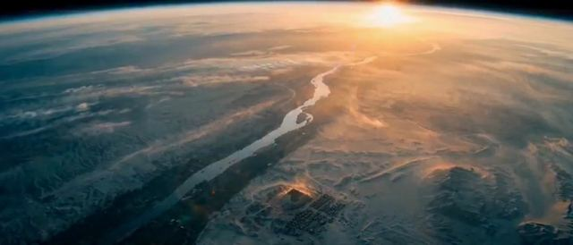

[← 返回图库](../browse/stories.md) · [English](2108195593176715520.en.md)

# Watchers：AI 叙事短片

**[Ehsan · @ehsaanveisii](https://x.com/ehsaanveisii)** · 叙事短片 · 695s

> 发现池 · 来源已核对，编目资料待完善。

**[▶ 打开画廊播放](https://guanmo-ai.github.io/awesome-ai-motion/#case-2108195593176715520)** · [作者原帖](https://x.com/ehsaanveisii/status/2108195593176715520)

点击封面打开画廊播放。

作者在 Higgsfield 制作 Watchers，先准备剧本、角色与场景设定图，再用 Nano Banana 生成静帧、Seedance 2.0 制作各镜头。

未取得作者公开提示词。 [查看作者原帖](https://x.com/ehsaanveisii/status/2108195593176715520)

收藏 0 · 点赞 1 · 浏览 12

## 来源记录

- 作品原帖: [@ehsaanveisii](https://x.com/ehsaanveisii/status/2108195593176715520) · 2026-10-08T13:59:32+00:00
- 模型归因: Seedance 2.0 · [作者说明](https://x.com/ehsaanveisii/status/2108195593176715520)
- 提示词查阅记录: [作者原帖](https://x.com/ehsaanveisii/status/2108195593176715520) · 2026-10-08 14:25 UTC
- 封面来源: [原帖封面来源](https://x.com/ehsaanveisii/status/2108195593176715520) · 5s
- 互动快照: [X 原帖](https://x.com/ehsaanveisii/status/2108195593176715520) · 2026-10-08 14:25 UTC
- 画廊原视频: [原帖媒体记录](https://x.com/ehsaanveisii/status/2108195593176715520) · 2026-10-08 14:25 UTC · 已核对原帖媒体对应与媒体响应；外部引用，不重新上传

模型依据来自作者自述，未独立重跑提示词，也未对音画作统一质量评级。视频引用作者原帖媒体，未由本站重新上传，转载许可未确认。
