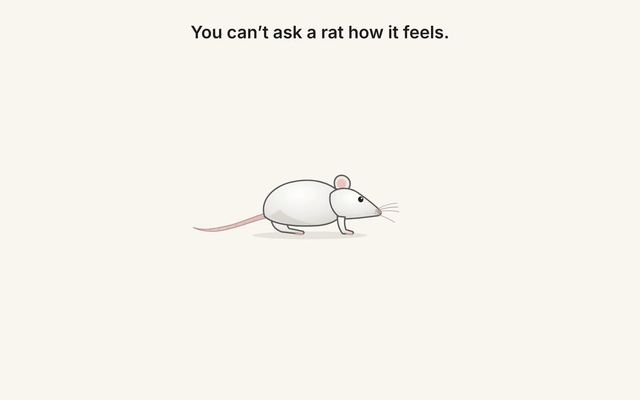

[← 返回图库](../browse/education.md) · [English](2108313983505842650.en.md)

# Hidden Valence 论文的动画解释

**[Cameron Berg · @camhberg](https://x.com/camhberg)** · 知识讲解 · 140s

> 发现池 · 来源已核对，编目资料待完善。

**[▶ 打开画廊播放](https://guanmo-ai.github.io/awesome-ai-motion/#case-2108313983505842650)** · [作者原帖](https://x.com/camhberg/status/2108313983505842650)

点击封面打开画廊播放。

作者让 Opus 5.5 为自己团队的 Hidden Valence 论文制作动画解释，以简笔角色和字幕组织内容。收录记录制作归因。

未取得作者公开提示词。 [查看作者原帖](https://x.com/camhberg/status/2108313983505842650)

收藏 41 · 点赞 115 · 浏览 2,525

## 来源记录

- 作品原帖: [@camhberg](https://x.com/camhberg/status/2108313983505842650) · 2026-10-08T21:49:58+00:00
- 模型归因: Claude Opus 5.5 · [作者说明](https://x.com/camhberg/status/2108313983505842650)
- 提示词查阅记录: [作者原帖](https://x.com/camhberg/status/2108313983505842650) · 2026-10-09 04:02 UTC
- 封面来源: [原帖封面来源](https://pbs.twimg.com/amplify_video_thumb/2108312955448152064/img/EoCiK9S3fQZlVhbx.jpg)
- 互动快照: [X 原帖](https://x.com/camhberg/status/2108313983505842650) · 2026-10-09 04:02 UTC
- 画廊原视频: [原帖媒体记录](https://x.com/camhberg/status/2108313983505842650) · 2026-10-09 04:02 UTC · 已核对原帖媒体对应与媒体响应；外部引用，不重新上传

模型依据来自作者自述，未独立重跑提示词，也未对音画作统一质量评级。视频引用作者原帖媒体，未由本站重新上传，转载许可未确认。
