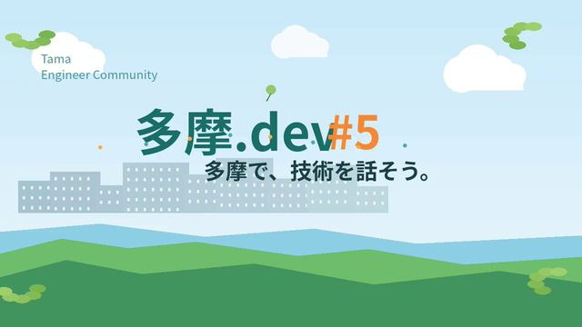

[← 返回图库](../browse/product.md) · [English](2108333603377877195.en.md)

# 多摩.dev 第五期活动推广短片

**[幡ヶ谷亭直吉@多摩.dev／秦野アジャイル／子育てエンジニアリングMeetup · @asagayanaoki](https://x.com/asagayanaoki)** · 产品宣传 · 15s

> 发现池 · 来源已核对，编目资料待完善。

**[▶ 打开画廊播放](https://guanmo-ai.github.io/awesome-ai-motion/#case-2108333603377877195)** · [作者原帖](https://x.com/asagayanaoki/status/2108333603377877195)

点击封面打开画廊播放。

作者让 ChatGPT 制作技术社区活动推广片，公开多摩.dev 第五期的活动字卡和动画；Opus 5.5 仅作为尝试动机提到。

未取得作者公开提示词。 [查看作者原帖](https://x.com/asagayanaoki/status/2108333603377877195)

收藏 0 · 点赞 2 · 浏览 147

## 来源记录

- 作品原帖: [@asagayanaoki](https://x.com/asagayanaoki/status/2108333603377877195) · 2026-10-08T23:07:56+00:00
- 模型归因: ChatGPT（版本未说明） · [作者说明](https://x.com/asagayanaoki/status/2108333603377877195)
- 提示词查阅记录: [作者原帖](https://x.com/asagayanaoki/status/2108333603377877195) · 2026-10-09 04:03 UTC
- 封面来源: [原帖封面来源](https://pbs.twimg.com/amplify_video_thumb/2108333587535949824/img/sLdD-iF9SuCZEZhw.jpg)
- 互动快照: [X 原帖](https://x.com/asagayanaoki/status/2108333603377877195) · 2026-10-09 04:03 UTC
- 画廊原视频: [原帖媒体记录](https://x.com/asagayanaoki/status/2108333603377877195) · 2026-10-09 04:03 UTC · 已核对原帖媒体对应与媒体响应；外部引用，不重新上传

模型依据来自作者自述，未独立重跑提示词，也未对音画作统一质量评级。视频引用作者原帖媒体，未由本站重新上传，转载许可未确认。
