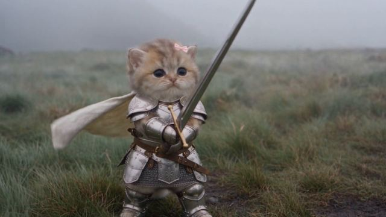

[← Back to gallery](../browse/characters.en.md) · [简体中文](2108359012328849486.md)

# A Knight-cat Short

**[yes& · @yesand\_ai](https://x.com/yesand_ai)** · Pixel art & characters · 24s

> Discovery pool · Source verified; catalog details being completed.

**[▶ Open gallery to play](https://guanmo-ai.github.io/awesome-ai-motion/?lang=en#case-2108359012328849486)** · [Original post](https://x.com/yesand_ai/status/2108359012328849486)

Click the cover to open the gallery and play.

YesAnd shares a Seedance 2.5 knight-cat short with armor, a small sword and a grassy setting.

No public prompt has been verified. [View the original post](https://x.com/yesand_ai/status/2108359012328849486)

Bookmarks 1 · Likes 6 · Views 373

## Source record

- Original post: [@yesand\_ai](https://x.com/yesand_ai/status/2108359012328849486) · 2026-10-09T00:48:54+00:00
- Model attribution: Seedance 2.5 · [Creator’s statement](https://x.com/yesand_ai/status/2108359012328849486)
- Prompt lookup: [Creator post](https://x.com/yesand_ai/status/2108359012328849486) · 2026-10-09 04:03 UTC
- Cover source: [Original cover source](https://pbs.twimg.com/amplify_video_thumb/2108358820611383296/img/0jNWkBplxb9kgVP_.jpg)
- Metrics snapshot: [Original X post](https://x.com/yesand_ai/status/2108359012328849486) · 2026-10-09 04:03 UTC
- Gallery video source: [Original post media record](https://x.com/yesand_ai/status/2108359012328849486) · 2026-10-09 04:03 UTC · Post/media correspondence and media response checked; external reference, no re-upload

Model attribution is based on creator statements. Prompts have not been independently rerun; sound and visuals have not received a uniform quality rating. Videos reference original post media, not our uploads; redistribution permission has not been verified.
