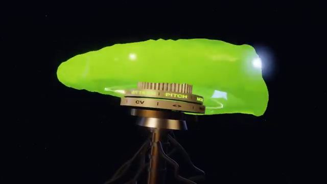

[← Back to gallery](../browse/music.en.md) · [简体中文](2108388293469688151.md)

# A Character-free Trance 3D Music Visual

**[cherusi · @cherusi3](https://x.com/cherusi3)** · Music & lyrics · 156s

> Discovery pool · Source verified; catalog details being completed.

**[▶ Open gallery to play](https://guanmo-ai.github.io/awesome-ai-motion/?lang=en#case-2108388293469688151)** · [Original post](https://x.com/cherusi3/status/2108388293469688151)

Click the cover to open the gallery and play.

Claude arranges 3D visuals and editing for an instrumental trance track, with a no-characters constraint and abstract apparatus imagery.

Author brief · not the complete prompt. The complete instructions have not been verified; see the creator’s post. [View the original post](https://x.com/cherusi3/status/2108388293469688151)

Bookmarks 0 · Likes 0 · Views 9

## Source record

- Original post: [@cherusi3](https://x.com/cherusi3/status/2108388293469688151) · 2026-10-09T02:45:15+00:00
- Model attribution: Claude Opus（版本未说明） · [Creator’s statement](https://x.com/cherusi3/status/2108388293469688151)
- Prompt source: [Creator post](https://x.com/cherusi3/status/2108388293469688151) · 2026-10-09 04:03 UTC
- Cover source: [Original cover source](https://x.com/cherusi3/status/2108388293469688151) · 55s
- Metrics snapshot: [Original X post](https://x.com/cherusi3/status/2108388293469688151) · 2026-10-09 04:03 UTC
- Gallery video source: [Original post media record](https://x.com/cherusi3/status/2108388293469688151) · 2026-10-09 04:03 UTC · Post/media correspondence and media response checked; external reference, no re-upload

Model attribution is based on creator statements. Prompts have not been independently rerun; sound and visuals have not received a uniform quality rating. Videos reference original post media, not our uploads; redistribution permission has not been verified.
