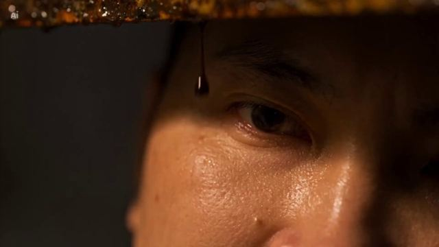

[← Back to gallery](../browse/stories.en.md) · [简体中文](2108420740383223854.md)

# DON’T LOOK UP: Suspense Near the Exit

**[Cas Tuấn Anh · @Castuananh](https://x.com/Castuananh)** · Narrative films · 33s

> Discovery pool · Source verified; catalog details being completed.

**[▶ Open gallery to play](https://guanmo-ai.github.io/awesome-ai-motion/?lang=en#case-2108420740383223854)** · [Original post](https://x.com/Castuananh/status/2108420740383223854)

Click the cover to open the gallery and play.

Cas Tuấn Anh credits himself as writer and director of a CapCut/Seedance 2.5 suspense scene, built around an unreachable exit and a threat overhead.

No public prompt has been verified. [View the original post](https://x.com/Castuananh/status/2108420740383223854)

Bookmarks 0 · Likes 0 · Views 3

## Source record

- Original post: [@Castuananh](https://x.com/Castuananh/status/2108420740383223854) · 2026-10-09T04:54:11+00:00
- Model attribution: Seedance 2.5；CapCut · [Creator’s statement](https://x.com/Castuananh/status/2108420740383223854)
- Prompt lookup: [Creator post](https://x.com/Castuananh/status/2108420740383223854) · 2026-10-09 11:42 UTC
- Cover source: [Original cover source](https://pbs.twimg.com/amplify_video_thumb/2108420704773509120/img/qFDfnD9pVyBXlNRj.jpg)
- Metrics snapshot: [Original X post](https://x.com/Castuananh/status/2108420740383223854) · 2026-10-09 11:42 UTC
- Gallery video source: [Original post media record](https://x.com/Castuananh/status/2108420740383223854) · 2026-10-09 11:42 UTC · Post/media correspondence and media response checked; external reference, no re-upload

Model attribution is based on creator statements. Prompts have not been independently rerun; sound and visuals have not received a uniform quality rating. Videos reference original post media, not our uploads; redistribution permission has not been verified.
