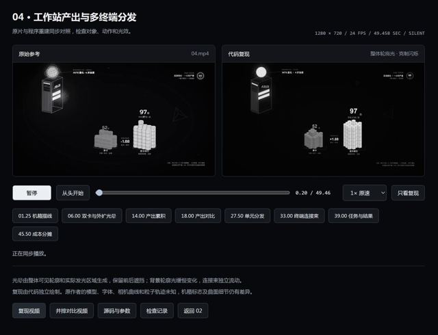

[← Back to gallery](../browse/motion.en.md) · [简体中文](2108447153098207345.md)

# A Side-by-side Codex Motion Recreation

**[蒋啊讲 · @TTDD686](https://x.com/TTDD686)** · Motion design · 50s

> Discovery pool · Source verified; catalog details being completed.

**[▶ Open gallery to play](https://guanmo-ai.github.io/awesome-ai-motion/?lang=en#case-2108447153098207345)** · [Original post](https://x.com/TTDD686/status/2108447153098207345)

Click the cover to open the gallery and play.

The creator shows a side-by-side recording of reference motion and a Codex recreation, discussing further refinement. Similarity percentages are the creator’s assessment.

No public prompt has been verified. [View the original post](https://x.com/TTDD686/status/2108447153098207345)

Bookmarks 0 · Likes 1 · Views 18

## Source record

- Original post: [@TTDD686](https://x.com/TTDD686/status/2108447153098207345) · 2026-10-09T06:39:09+00:00
- Model attribution: Codex（版本未说明） · [Creator’s statement](https://x.com/TTDD686/status/2108447153098207345)
- Prompt lookup: [Creator post](https://x.com/TTDD686/status/2108447153098207345) · 2026-10-09 11:42 UTC
- Cover source: [Original cover source](https://pbs.twimg.com/amplify_video_thumb/2108446112021618688/img/c7KjRINyfLUh1nOZ.jpg)
- Metrics snapshot: [Original X post](https://x.com/TTDD686/status/2108447153098207345) · 2026-10-09 11:42 UTC
- Gallery video source: [Original post media record](https://x.com/TTDD686/status/2108447153098207345) · 2026-10-09 11:42 UTC · Post/media correspondence and media response checked; external reference, no re-upload

Model attribution is based on creator statements. Prompts have not been independently rerun; sound and visuals have not received a uniform quality rating. Videos reference original post media, not our uploads; redistribution permission has not been verified.
