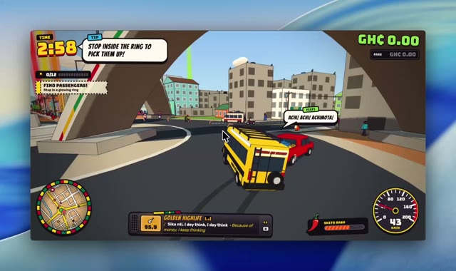

[← Back to gallery](../browse/interactive.en.md) · [简体中文](2108906748840972621.md)

# Accra Crazy Trotro: An Accra Driving Game

**[Eddie Forson · @Ed\_Forson](https://x.com/Ed_Forson)** · 3D & interactive · 135s

> Discovery pool · Source verified; catalog details being completed.

**[▶ Open gallery to play](https://guanmo-ai.github.io/awesome-ai-motion/?lang=en#case-2108906748840972621)** · [Original post](https://x.com/Ed_Forson/status/2108906748840972621)

Click the cover to open the gallery and play.

The creator presents Accra Crazy Trotro, described as their first game co-created with Claude Opus 5.5. The recording shows minibus driving through city streets; no complete prompt, source code or playable link is provided.

Author brief · not the complete prompt. The complete instructions have not been verified; see the creator’s post. [View the original post](https://x.com/Ed_Forson/status/2108906748840972621)

Bookmarks 0 · Likes 11 · Views 333

## Source record

- Original post: [@Ed\_Forson](https://x.com/Ed_Forson/status/2108906748840972621) · 2026-10-10T13:05:25+00:00
- Model attribution: Claude Opus 5.5 · [Creator’s statement](https://x.com/Ed_Forson/status/2108906748840972621)
- Prompt source: [Creator post](https://x.com/Ed_Forson/status/2108906748840972621) · 2026-10-10 15:00 UTC
- Cover source: [Original cover source](https://x.com/Ed_Forson/status/2108906748840972621) · 18s
- Metrics snapshot: [Original X post](https://x.com/Ed_Forson/status/2108906748840972621) · 2026-10-10 15:00 UTC
- Gallery video source: [Original post media record](https://x.com/Ed_Forson/status/2108906748840972621) · 2026-10-10 15:00 UTC · Post/media correspondence and media response checked; external reference, no re-upload

Model attribution is based on creator statements. Prompts have not been independently rerun; sound and visuals have not received a uniform quality rating. Videos reference original post media, not our uploads; redistribution permission has not been verified.
