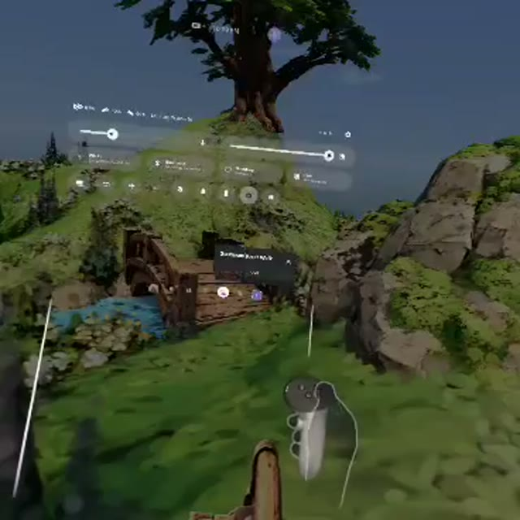

[← Back to gallery](../browse/interactive.en.md) · [简体中文](2108918893523963917.md)

# Locus Amoenus: A Gaussian Splat Scene

**[Stefano Rivera · @easyldur](https://x.com/easyldur)** · 3D & interactive · 207s

> Discovery pool · Source verified; catalog details being completed.

**[▶ Open gallery to play](https://guanmo-ai.github.io/awesome-ai-motion/?lang=en#case-2108918893523963917)** · [Original post](https://x.com/easyldur/status/2108918893523963917)

Click the cover to open the gallery and play.

The creator credits TripoSplat for scene assets and Claude Opus 5.5 for composition in PlayCanvas and sound effects. The post highlights relighting and the scene experience without sharing a complete prompt or project link.

Author brief · not the complete prompt. The complete instructions have not been verified; see the creator’s post. [View the original post](https://x.com/easyldur/status/2108918893523963917)

Bookmarks 0 · Likes 2 · Views 52

## Source record

- Original post: [@easyldur](https://x.com/easyldur/status/2108918893523963917) · 2026-10-10T13:53:40+00:00
- Model attribution: Claude Opus 5.5 / TripoSplat / PlayCanvas · [Creator’s statement](https://x.com/easyldur/status/2108918893523963917)
- Prompt source: [Creator post](https://x.com/easyldur/status/2108918893523963917) · 2026-10-10 15:00 UTC
- Cover source: [Original cover source](https://x.com/easyldur/status/2108918893523963917) · 1s
- Metrics snapshot: [Original X post](https://x.com/easyldur/status/2108918893523963917) · 2026-10-10 15:00 UTC
- Gallery video source: [Original post media record](https://x.com/easyldur/status/2108918893523963917) · 2026-10-10 15:00 UTC · Post/media correspondence and media response checked; external reference, no re-upload

Model attribution is based on creator statements. Prompts have not been independently rerun; sound and visuals have not received a uniform quality rating. Videos reference original post media, not our uploads; redistribution permission has not been verified.
